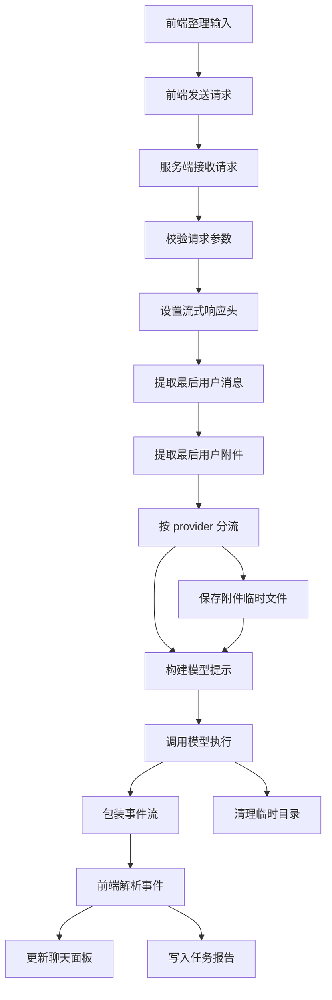
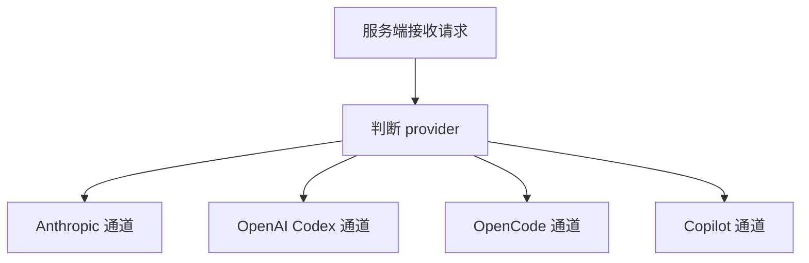

# AI聊天服务端接收请求到模型返回链路梳理

## 文档定位

这份文档是对 [AI聊天开始到完成任务整体流程](./AI聊天开始到完成任务整体流程.md) 中这三步的展开说明：

1. 服务端接收请求
2. 保存附件临时文件
3. 调用模型执行

重点不是重复大流程，而是把这一小段拆到“代码层能直接对上”的粒度，说明：

- 请求是谁发起的
- 服务端收到了什么
- 附件什么时候落盘
- 不同 provider 怎么执行
- 结果最后怎么再回到前端
- 任务报告是怎么同步写入的

## 类比理解

可以把这一段理解成“快递分拣中心”：

- 前端像寄件柜台，负责把文本和图片打包好
- `server/api/ai/chat.ts` 像总分拣口，先验单，再决定发哪条线路
- `saveAttachmentsToTempFiles` 像临时寄存区，先把图片放到可读取的位置
- 各 provider 执行函数像不同物流公司
- SSE 返回流像物流轨迹，前端一边收一边更新聊天面板

## 关注范围

这份文档主要覆盖下面这条链路：

- 前端上传图片并转成 base64
- 前端通过 `streamChat` 发起 `POST /api/ai/chat`
- 服务端校验请求并按 provider 分流
- 如有附件，按 provider 需要决定是否保存为临时文件
- 调用 Claude Agent SDK 或 Codex CLI 或 OpenCode SDK 或 Copilot SDK
- 把模型结果重新包装为 SSE 事件流
- 前端消费 `thinking` `text` `error` `done`
- 任务报告通过 `/api/ai/task-report` 持续写入 Markdown

## 总体分层流程图



## 第一层 前端是怎么把请求送到服务端的

### 入口文件

- `src/components/panels/ai-chat-panel.tsx`
- `src/components/panels/ai-chat-handlers.ts`
- `src/services/ai/ai-service.ts`

### 前端输入整理

#### 图片附件

图片是在 `ai-chat-panel.tsx` 里通过 `FileReader.readAsDataURL` 读取的，然后取 `dataUrl.split(',')[1]` 得到 base64，再存入待发送附件列表。

前端保存的附件结构大致是：

```json
{
  "id": "local attachment id",
  "name": "demo.png",
  "mediaType": "image/png",
  "data": "base64",
  "size": 12345
}
```

这里有两个很重要的前置约束：

- 单文件最大 5MB
- 最多 4 个附件
- 只接受 `image` 类型

#### 聊天消息

`ai-chat-handlers.ts` 会把：

- 用户原始文本
- 画布上下文
- 历史消息
- 附件
- 当前 provider
- 当前 model

组合后交给 `streamChat`。

### 发送到服务端的请求体

`streamChat` 最终向 `/api/ai/chat` 发送 JSON：

```json
{
  "system": "system prompt",
  "messages": [
    {
      "role": "user",
      "content": "user text",
      "attachments": [
        {
          "name": "image.png",
          "mediaType": "image/png",
          "data": "base64"
        }
      ]
    }
  ],
  "model": "model id",
  "provider": "anthropic",
  "thinkingMode": "adaptive",
  "thinkingBudgetTokens": 0,
  "effort": "medium"
}
```

这里要注意：

- 前端把 `system` prompt 明确传入，服务端不是自己凭空生成 prompt
- 附件跟在消息对象上，而不是独立字段
- `provider` 和 `model` 都必须显式传

## 第二层 服务端接收请求

### 入口文件

- `server/api/ai/chat.ts`

### 服务端接收后的第一批动作

`defineEventHandler` 收到请求后，先做四件事：

1. `readBody<ChatBody>(event)` 读请求体
2. 校验 `system` 和 `messages`
3. 校验 `provider`
4. 校验 `model`

它的策略很明确：

- 不允许 provider fallback
- 不允许 model fallback
- provider 只支持 `anthropic` `openai` `opencode` `copilot`

也就是说，这里像机场安检，不符合条件的请求不会继续往下走。

### 设置返回格式

通过校验后，服务端会立刻把响应头改成 SSE：

```text
Content Type text event stream
Cache Control no cache
Connection keep alive
```

然后才进入 provider 分流。

### 分流逻辑



对应函数分别是：

- `streamViaAgentSDK`
- `streamViaCodex`
- `streamViaOpenCode`
- `streamViaCopilot`

## 第三层 保存附件临时文件

### 统一入口函数

- `saveAttachmentsToTempFiles`

### 这个函数到底做了什么

它做的是一件很朴素但很关键的事：

把前端传来的 base64 图片，落成真实文件路径，让后面的模型执行层能“看得见”。

处理步骤是：

1. 选择临时目录位置
2. 根据 `mediaType` 推断后缀
3. 把 base64 转成 `Buffer`
4. 按顺序写成 `0.png` `1.jpeg` 这类文件
5. 返回 `{ tempDir, files }`

### 附件只取谁的

这里不是扫全量消息历史，而是只拿：

- 最后一条 `role === user` 的消息
- 其中的 `attachments`

也就是说，服务端当前的图片输入语义是：

“只处理本轮最后一次用户发来的附件”

这个设计比较像“本次工单的最新附图”，而不是“把聊天记录里的所有老图重新喂一遍”。

### 媒体类型限制

允许的媒体类型只有：

- `image/png`
- `image/jpeg`
- `image/gif`
- `image/webp`

如果类型不在允许列表里，扩展名会回退成 `png`。

### 为什么有两种临时目录策略

#### 策略一 保存到项目内

Anthropic 图像场景会传 `insideProject = true`，于是附件会存到：

- `.openpencil-tmp/attach-xxxx`

原因不是随便选的，而是 Claude Agent SDK 在这里使用的是：

- `permissionMode: 'plan'`

这种模式下，Agent 更适合读取项目工作区内可访问的文件，所以图片要故意放进项目目录下，避免“文件存在，但 Agent 没权限读”的问题。

#### 策略二 保存到系统临时目录

Codex 这类 CLI 场景，会存到：

- 系统 `tmpdir()`
- 目录前缀 `openpencil-attach-`

因为它们更像是“把文件路径交给外部进程”，只要 CLI 进程能读到就行，不要求一定在项目目录里。

### 临时文件策略对比

| 场景 | 是否落盘 | 落盘位置 | 原因 |
| --- | --- | --- | --- |
| Anthropic 图片模式 | 是 | 项目内 `.openpencil-tmp` | 让 Agent 在 plan 权限模式下可读 |
| Codex 图片模式 | 是 | 系统临时目录 | 给 CLI `--image` 参数用 |
| OpenCode | 否 | 不落盘 | 直接把图片拼成 data URL 传 SDK |
| Copilot | 当前未接附件 | 无 | 当前实现只送文本 prompt |

### 清理时机

凡是走了临时目录的 provider，都会在 `finally` 里做清理：

- `rm(tempDir, { recursive: true, force: true })`

这点很重要，因为这条链路是高频调用的，不清理就会像会场门口不断堆积一次性包装盒。

## 第四层 调用模型执行

这一层虽然都叫“聊天”，但四条 provider 实际完全不是同一种执行方式。

## Provider 执行总览

| Provider | 执行入口 | 附件输入方式 | 模型返回方式 | 服务端对前端的输出节奏 |
| --- | --- | --- | --- | --- |
| Anthropic | `streamViaAgentSDK` | 临时文件加 Read 指令 | 真流式 或 result 模式 | 连续 `thinking` `text` |
| Codex | `streamViaCodex` | 临时文件加 `--image` | CLI 完整结果 | 通常一次 `text` 后 `done` |
| OpenCode | `streamViaOpenCode` | data URL parts | 完整响应 parts | 逐段转 `text` 后 `done` |
| Copilot | `streamViaCopilot` | 当前无附件通路 | 流式 delta | 连续 `text` delta |

## Anthropic 通道

### 关键特点

- 使用 `@anthropic-ai/claude-agent-sdk`
- 同时支持纯文本流式输出和图片分析
- 图片场景会修改 prompt 结构

### 纯文本模式

纯文本时，核心配置是：

- `maxTurns: 1`
- `includePartialMessages: true`
- `tools: []`
- `plugins: []`
- `permissionMode: 'plan'`
- `persistSession: false`

这意味着：

- 目标是单轮响应
- 允许 partial message 流式返回
- 服务端自己把流式 delta 包装成 SSE

返回过程中：

- `text_delta` 会被转成 `type: text`
- `thinking_delta` 会被转成 `type: thinking`

### 图片模式

图片模式更特别：

1. 先把附件保存到项目内临时目录
2. 把 prompt 改写成一组 Read 指令加原始用户问题
3. 如果系统 prompt 里有 `NEVER use tools` 一类限制，会先剥掉
4. 改用 result based 流程而不是 partial stream

Anthropic 图片模式里拼出来的 prompt 思路是：

- 先让 Agent 用 `Read` 读本地图片文件
- 再分析图片并回复用户

这一步非常关键，因为它不是“把 base64 直接喂进去”，而是“把图片变成 Agent 可读的本地文件，再让 Agent 主动读取”。

### 错误处理

Anthropic 通道还有一层增强错误提示：

- `readDebugTail`
- `buildClaudeExitHint`

也就是服务端会尝试读取 debug 日志尾部，再把一些常见错误翻译成更像人话的提示，例如：

- 配置文件无权限
- 上游网络连接失败
- 鉴权头没带上

这让它不像只报“退出码 1”，而更像“告诉你是卡在哪个门口了”。

## Codex 通道

### 关键特点

- 入口是 `runCodexExec`
- 本质是启动外部 `codex` CLI 进程
- 返回是“准流式”，不是 provider 原生 delta

### Prompt 组装方式

Codex 不直接单独传 system prompt 和 user prompt，而是先在 `server/utils/codex-client.ts` 里拼成：

```text
SYSTEM INSTRUCTIONS
system prompt

USER REQUEST
user prompt
```

然后通过 stdin 送给 CLI。

### 附件方式

如果有图片：

- 先保存到系统临时目录
- 再通过 `--image` 参数传给 `codex exec`

### 执行特点

Codex 侧会：

- `--json`
- `--skip-git-repo-check`
- `--sandbox read-only`
- `--output-last-message`

服务端最后读取 `last-message.txt`，再把最终文本统一回传给前端。

所以 Codex 路线更像：

- 后端内部先完整跑完
- 前端再收到最终答案

而不是 Anthropic 那种边想边吐 token。

## OpenCode 通道

### 关键特点

- 先创建 session
- 用 `noReply: true` 注入系统提示
- 再把用户输入和图片一起作为 `parts` 发送

### 图片处理方式

OpenCode 不走临时文件，而是直接把附件变成：

```text
data mediaType base64
```

对应 `parts` 结构里会有：

- `type: image`
- `url: data:image/png;base64,...`

这条线路的优点是干净：

- 不需要额外落盘
- 不需要清理临时目录

### Thinking 逻辑

OpenCode 还会构建 reasoning 配置：

- `effort`
- `enabled`
- `budgetTokens`

如果 provider 不接受 reasoning 参数，会自动降级重试一次，不带 reasoning 再发。

这相当于：

- 先走增强版请求
- 失败了再走兼容版请求

## Copilot 通道

### 关键特点

- 通过 `@github/copilot-sdk`
- 创建 streaming session
- 监听 `assistant.message_delta`

### Prompt 逻辑

Copilot 这条线把系统提示放在：

- `systemMessage: { mode: 'replace', content: body.system }`

用户输入只取最后一条 user message 的 `content`。

### 当前限制

从现有实现看，Copilot 通道当前没有把附件传入 session。

这意味着：

- 纯文本聊天没问题
- 如果前端传了图片，当前这条 provider 实现实际上没有消费附件

这属于文档里必须标出来的“实现现状”，不然流程图会让人误以为四条线路都支持附件落盘和图像分析。

## 第五层 提示词逻辑到底来自哪里

这是这条链路里最容易混淆的点。

很多人会误以为 `/api/ai/chat` 自己决定怎么提示模型，其实不是。

大部分情况下：

- prompt 的业务语义来自前端或上层 AI 调度器
- `/api/ai/chat` 只负责接收和转发
- 只有在附件场景下，服务端会做少量 prompt 改写

## Prompt 来源矩阵

| 调用场景 | 调用方 | 传给 `/api/ai/chat` 的 system prompt |
| --- | --- | --- |
| 普通聊天 | `ai-chat-handlers.ts` | `CHAT_SYSTEM_PROMPT` |
| 设计修改 | `design-generator.ts` | `DESIGN_MODIFIER_PROMPT` |
| 规划阶段 | `orchestrator.ts` | `ORCHESTRATOR_PROMPT` |
| 子任务生成 | `orchestrator-sub-agent.ts` | `SUB_AGENT_PROMPT` 加设计原则 |
| 代码优化面板 | `code-panel.tsx` | 面板内部拼出的优化 prompt |

### 这说明什么

`/api/ai/chat` 更像“统一传输总线”，不是“业务 prompt 工厂”。

它主要做三类事：

1. 参数校验
2. provider 路由
3. 附件适配

### 服务端会改写 prompt 的场景

#### Anthropic 图片模式

会在用户原始 prompt 前面加上：

- 先读哪个文件
- 再分析图片并回答

同时会去掉 `NEVER use tools` 这类限制，避免 Read 工具被 prompt 自己堵死。

#### Codex 附件模式

如果用户没有文本，Codex 会兜底成：

- `Analyze the attached image and answer the user.`

#### OpenCode 附件模式

如果没有文本，会兜底成：

- `Analyze these images.`

### 一个重要结论

同样是“图片问答”，四条 provider 的喂法其实完全不同：

- Anthropic 是本地文件加 Read 工具
- Codex 是本地文件加 CLI 图片参数
- OpenCode 是 data URL parts
- Copilot 当前没有完整图片输入通路

## 第六层 返回逻辑和前端消费逻辑

### 服务端统一输出格式

虽然内部 provider 差异很大，但发给前端时统一成 SSE 数据块：

```json
{
  "type": "thinking",
  "content": "..."
}
```

```json
{
  "type": "text",
  "content": "..."
}
```

```json
{
  "type": "error",
  "content": "..."
}
```

```json
{
  "type": "done",
  "content": ""
}
```

另外还有保活包：

```json
{
  "type": "ping",
  "content": ""
}
```

### 为什么需要 ping

服务端设置了固定心跳：

- `KEEPALIVE_INTERVAL_MS = 15000`

作用是：

- 在真正文本出来前先保活连接
- 避免前端以为“服务端已经卡死”

### 前端怎么消费

`ai-service.ts` 会：

1. `fetch('/api/ai/chat')`
2. 读取 `response.body.getReader()`
3. 按行切 `data: ...`
4. JSON parse 成 chunk
5. 分别处理 `ping` `thinking` `text` `error` `done`

其中：

- `ping` 默认只用来重置超时，不显示到 UI
- `thinking` 会显示在思考区
- `text` 会追加到正文
- `error` 会终止本轮
- `done` 会收尾退出

### 不同 provider 对前端观感的差异

#### Anthropic

用户通常能看到：

- 先是 thinking
- 再是连续 text

交互感最像“边想边答”。

#### Codex

用户更可能看到：

- 一段时间只有 ping
- 然后一次性 text

交互感更像“后台跑完后统一提交”。

#### OpenCode

看起来介于两者之间，但当前实现本质更接近“收到完整 parts 后转发”。

#### Copilot

如果 provider 正常流式输出 delta，前端会像普通 token 流一样逐步收到文本。

## 第七层 任务报告怎么跟这条链路并行工作

虽然任务报告不是 `/api/ai/chat` 的一部分，但它和这条链路是并行绑定的。

### 相关文件

- `src/services/ai/task-report-service.ts`
- `server/api/ai/task-report.post.ts`
- `server/utils/task-report-markdown.ts`

### 工作方式

`ai-chat-handlers.ts` 在发送请求前就会：

1. `startTaskReport`
2. 拿到 `reportId`
3. 在收到 `thinking` `text` `error` 时持续 `updateTaskReport`
4. 最后强制 flush 一次

也就是说，任务报告不是等聊天结束后一次性生成，而是边跑边写。

### 附件在任务报告里的处理

任务报告只记录附件元信息：

- 文件名
- 媒体类型
- 文件大小

不会把完整 base64 塞进 Markdown。

这个设计很合理，因为：

- 报告需要可读
- 不能让 Markdown 膨胀成一大坨图片数据

## 关键实现差异总结

## 结论一

“服务端接收请求”这一层不是智能决策中心，而是严格的通道入口：

- 校验
- 分流
- 包装返回

## 结论二

“保存附件临时文件”只在部分 provider 需要：

- Anthropic 和 Codex 需要真实文件路径
- OpenCode 直接走 data URL
- Copilot 当前没有附件消费通路

## 结论三

“调用模型执行”不是统一抽象后完全一致，而是四套不同机制共用一条 SSE 外壳。

外面看像一条路，里面其实是四种运输方式：

- Claude 像人工现场讲解
- Codex 像后台批处理
- OpenCode 像会话式装箱后一次提交
- Copilot 像事件订阅式回推

## 关键风险点

1. 只读取最后一条 user 附件

如果用户以为“上一轮的图还在上下文里”，那当前实现未必会再次读取。

2. Copilot 图片链路不完整

如果选了 Copilot 又传了图片，文档上要明确这是当前实现缺口，不是用户操作错了。

3. Anthropic 图片模式依赖项目内临时目录

如果 `.openpencil-tmp` 权限或路径策略变化，Read 工具链会直接失效。

4. Codex 更偏最终结果

如果前端希望所有 provider 都持续吐 delta，那 Codex 这条路会有体验差异。

5. prompt 改写发生在服务端附件适配层

排查“为什么同一句话在有图和无图时行为不同”时，必须看这里，而不是只看前端传参。

## 相关源码定位

### 前端入口

- `src/components/panels/ai-chat-panel.tsx`
- `src/components/panels/ai-chat-handlers.ts`
- `src/services/ai/ai-service.ts`

### Prompt 来源

- `src/services/ai/ai-prompts.ts`
- `src/services/ai/orchestrator-prompts.ts`
- `src/services/ai/design-generator.ts`
- `src/services/ai/orchestrator.ts`
- `src/services/ai/orchestrator-sub-agent.ts`

### 服务端执行

- `server/api/ai/chat.ts`
- `server/utils/codex-client.ts`

### 任务报告

- `src/services/ai/task-report-service.ts`
- `server/api/ai/task-report.post.ts`
- `server/utils/task-report-markdown.ts`

## 引用说明

### 项目源码引用

- `D:\NodejsP\openpencil\src\components\panels\ai-chat-panel.tsx`
- `D:\NodejsP\openpencil\src\components\panels\ai-chat-handlers.ts`
- `D:\NodejsP\openpencil\src\services\ai\ai-service.ts`
- `D:\NodejsP\openpencil\src\services\ai\ai-prompts.ts`
- `D:\NodejsP\openpencil\src\services\ai\orchestrator-prompts.ts`
- `D:\NodejsP\openpencil\src\services\ai\design-generator.ts`
- `D:\NodejsP\openpencil\src\services\ai\task-report-service.ts`
- `D:\NodejsP\openpencil\server\api\ai\chat.ts`
- `D:\NodejsP\openpencil\server\api\ai\task-report.post.ts`
- `D:\NodejsP\openpencil\server\utils\codex-client.ts`
- `D:\NodejsP\openpencil\server\utils\task-report-markdown.ts`

### 外部参考地址

- MDN Server Sent Events 使用说明  
  https://developer.mozilla.org/en-US/docs/Web/API/Server-sent_events/Using_server-sent_events
- H3 Event 与请求处理说明  
  https://www.h3.dev/guide/api/h3event
- Anthropic Claude Code SDK 概览  
  https://docs.anthropic.com/en/docs/claude-code/sdk
- GitHub Copilot Coding Agent 概念说明  
  https://docs.github.com/en/copilot/concepts/coding-agent/coding-agent
