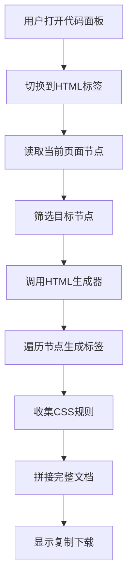
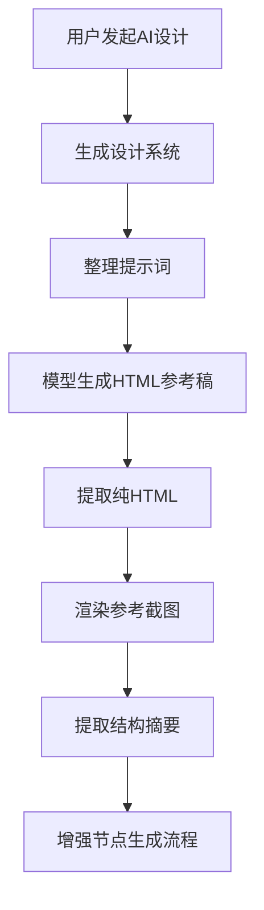

# HTML代码模板生成流程分析

## 结论先说

这个仓库里和“生成 HTML 代码模板”相关的逻辑，不是放在一个单独的静态模板文件里，而是分成两条链路：

1. 代码面板导出链路
当前画布节点在运行时被转换成 `HTML + CSS`，核心代码在 `src/services/codegen/html-generator.ts`。

2. AI 视觉参考链路
AI 先生成一份完整 HTML 参考稿，再把这份参考稿当作蓝图去指导后续节点生成，核心代码在 `src/services/ai/design-code-prompts.ts`、`src/services/ai/design-code-generator.ts`、`src/services/ai/visual-ref-orchestrator.ts`。

如果你问的是“右侧代码面板里切到 HTML 标签后，页面里那份 HTML 是从哪里来的”，最直接的入口是：

- `src/components/panels/code-panel.tsx` 第 123 到 125 行
- `src/services/codegen/html-generator.ts` 第 342 到 390 行

## 关键文件定位

### 一 代码面板实际生成 HTML 的入口

- `src/components/panels/code-panel.tsx:123`
- `src/services/codegen/html-generator.ts:342`
- `src/services/codegen/html-generator.ts:380`

这里的逻辑是：

1. `CodePanel` 根据当前标签页判断是否要生成 HTML
2. 当 `activeTab === html` 时，调用 `generateHTMLCode(targetNodes)`
3. 返回值分成两部分
   - `html`
   - `css`
4. 然后在 `code-panel.tsx` 里把它们再包一层完整文档
   - `<!DOCTYPE html>`
   - `<html>`
   - `<head>`
   - `<style>`
   - `<body>`

也就是说：

- `html-generator.ts` 负责生成页面主体结构和 CSS 规则
- `code-panel.tsx` 负责把这些内容拼成一份完整 HTML 文档

### 二 AI 生成完整 HTML 参考稿的入口

- `src/services/ai/design-code-prompts.ts:9`
- `src/services/ai/design-code-generator.ts:30`
- `src/services/ai/visual-ref-orchestrator.ts:87`

这里不是把 PenNode 转成 HTML，而是先让模型按提示词直接写一份完整 HTML 页面，作为后续设计生成的视觉参考。

## 流程图

### 一 代码面板导出 HTML 的流程

### 二 AI 视觉参考 HTML 的流程

## 代码逻辑分析

### 一 代码面板这条线怎么走

`src/components/panels/code-panel.tsx` 里的核心判断在 `generatedCode` 这个 `useMemo` 里。

当标签切到 `html` 时，执行的是下面这段逻辑：

1. 调用 `generateHTMLCode(targetNodes)`
2. 拿到 `{ html, css }`
3. 再拼成完整页面字符串
4. 最后把结果显示到代码面板里

这说明它不是读取某个模板文件，而是每次根据当前节点实时生成。

### 二 targetNodes 是什么

`targetNodes` 也是在 `code-panel.tsx` 里算出来的：

- 如果当前有选中节点，就只生成选中节点
- 如果没有选中节点，就生成当前页面全部节点

这就是为什么同一个 HTML 面板，有时候导出的是局部组件，有时候导出的是整页结构。

### 三 html generator 做了什么

`src/services/codegen/html-generator.ts` 是真正的核心。

它的职责可以拆成五层：

1. 样式值转换
   - `varOrLiteral`
   - `fillToCSS`
   - `strokeToCSS`
   - `effectsToCSS`
   - `cornerRadiusToCSS`
   - `layoutToCSS`

2. 节点内容提取
   - `getTextContent`
   - `escapeHTML`

3. 单节点递归生成
   - `generateNodeHTML`

4. CSS 规则汇总
   - `cssRulesToString`

5. 页面级包装
   - `generateHTMLCode`
   - `generateHTMLFromDocument`

### 四 generateNodeHTML 的核心思想

`generateNodeHTML` 用 `switch node.type` 按节点类型分别处理。

支持的主要节点有：

- `frame`
- `rectangle`
- `group`
- `ellipse`
- `text`
- `line`
- `polygon`
- `path`
- `image`
- `icon_font`
- `ref`

每种节点都会走同样的基本套路：

1. 先准备一份 `css` 对象
2. 把位置 宽高 透明度 旋转等通用信息写进去
3. 再按节点类型补充专属样式
4. 生成唯一类名
5. 把类名和样式规则推入 `rules`
6. 返回对应的 HTML 标签字符串

例如：

- 容器类节点通常变成 `
`
- 文本节点会按字号粗略映射成 `h1 h2 h3 p`
- 线段节点会变成 `
`
- 图片节点会变成 ``
- 路径节点会变成 `<svg><path /></svg>`

### 五 为什么会先生成类名再生成 CSS

这里的设计是：

- HTML 只关心结构和类名
- CSS 单独汇总成规则字符串

这样做有两个好处：

1. 结构和样式分离，最后可以很容易拼成 `<style>` 块
2. 同一个节点的样式生成过程比较集中，后面要加优化也方便

对应代码是：

- `nextClassName` 负责生成唯一类名
- `rules.push` 收集样式
- `cssRulesToString` 最后统一转成 CSS 文本

### 六 generateHTMLCode 的页面级逻辑

`generateHTMLCode` 不是简单把节点直接拼起来，它先做了一步容器尺寸计算。

主要过程：

1. 遍历所有节点
2. 计算最外层包裹容器的最大宽高
3. 创建 `.container`
4. 把每个节点递归生成成 HTML
5. 最后返回
   - `html`
   - `css`

所以它生成的是：

- 一个相对定位的 `.container`
- 一组内部节点
- 一整套按类名组织的 CSS 规则

### 七 generateHTMLFromDocument 和 generateHTMLCode 的区别

这两个函数名字很像，但职责不完全一样。

`generateHTMLCode`

- 输入是节点数组
- 只负责当前节点集合的 HTML 和 CSS 生成

`generateHTMLFromDocument`

- 输入是整个 `PenDocument`
- 会先取页面节点
- 还会把变量系统转成 CSS 变量

从当前仓库调用关系看，代码面板现在直接调用的是 `generateHTMLCode`，不是 `generateHTMLFromDocument`。

这意味着：

- 当前面板更偏向即时展示和局部导出
- `generateHTMLFromDocument` 更像是为完整文档导出预留的接口

## AI 视觉参考这条线的代码逻辑

### 一 design code prompt 才像真正的模板规则

如果你说的“HTML 代码模板”是指 AI 为什么总能吐出一整份完整 HTML 页面，那最像模板的地方其实是提示词：

- `src/services/ai/design-code-prompts.ts`

这里定义了模型必须遵守的规则，例如：

- 只输出完整 HTML 文档
- CSS 必须写在 `<style>` 里
- 使用现代 CSS
- 不能输出解释文字
- 页面要像成品设计稿

所以它不是硬编码的 HTML 模板，而是“提示词模板”。

### 二 design code generator 做的是清洗和兜底

`src/services/ai/design-code-generator.ts` 的作用像一个装配车间质检员。

它做三件事：

1. 组合系统提示词和用户提示词
2. 调用 `generateCompletion`
3. 用 `extractHtmlFromResponse` 从模型返回内容里提取纯 HTML

如果模型输出格式不干净，它会：

- 去掉代码块包裹
- 尝试从长文本里截出 `<!DOCTYPE html>` 到 `</html>`
- 如果还不行，就兜底包一层最基础的 HTML 文档

### 三 visual ref orchestrator 把 HTML 参考稿接入后续流程

`src/services/ai/visual-ref-orchestrator.ts` 的 Stage 1 到 Stage 3 是关键：

1. 先生成设计系统
2. 再生成 HTML 参考稿
3. 再把 HTML 渲染成截图
4. 再提取结构摘要
5. 最后把这些信息塞回后续节点生成流程

这条链路的核心思想是：

- 先让模型做它最擅长的视觉表达
- 再把视觉结果反哺给结构化节点生成

## 类比理解

可以把这两条链路想成两个不同岗位。

### 一 html generator 像施工图翻译员

画布里的 PenNode 就像设计软件里的图层清单。

`html-generator.ts` 做的事，不是自己发挥创意，而是把现有图层老老实实翻译成：

- 哪里该是 `div`
- 哪里该是 `h1`
- 哪里该是 `img`
- 样式该怎么落成 CSS

它更像“施工图翻译员”。

### 二 AI design code 像概念草图设计师

`design-code-prompts.ts` 加 `design-code-generator.ts` 这条线，不是翻译现有图层，而是先根据需求画一张高保真草图。

它像“概念草图设计师”：

- 先给你一张看起来很像成品的网站稿
- 再让后面的流程照着这张稿子拆解成节点结构

一个偏“翻译”，一个偏“先设计再反推”。

## 你现在最该看的文件

如果你的目标是改“代码面板里 HTML 导出的模板结构”，优先看这几个文件：

1. `src/components/panels/code-panel.tsx`
2. `src/services/codegen/html-generator.ts`
3. `src/services/codegen/css-variables-generator.ts`

如果你的目标是改“AI 生成完整 HTML 参考稿的风格和约束”，优先看这几个文件：

1. `src/services/ai/design-code-prompts.ts`
2. `src/services/ai/design-code-generator.ts`
3. `src/services/ai/visual-ref-orchestrator.ts`

## 我给你的直接判断

当前仓库里，“HTML 模板代码”并不是一个独立 `.html` 文件，而是：

- 前端代码面板里由 `code-panel.tsx` 动态包壳
- 节点结构由 `html-generator.ts` 动态递归生成
- AI 视觉参考则由提示词模板加模型输出共同决定

所以你后面改需求时，先要分清楚你要改的是哪一种：

1. 节点导出 HTML
2. AI 参考 HTML

这两个入口改错了，就会出现“我明明改了模板但界面没变化”的错觉。

## 参考链接

- MDN Using CSS custom properties https://developer.mozilla.org/en-US/docs/Web/CSS/Guides/Cascading_variables/Using_custom_properties
- MDN position https://developer.mozilla.org/en-US/docs/Web/CSS/Reference/Properties/position
- MDN Basic concepts of flexbox https://developer.mozilla.org/docs/Web/CSS/CSS_Flexible_Box_Layout/Basic_Concepts_of_Flexbox
- MDN display https://developer.mozilla.org/en-US/docs/Web/CSS/Reference/Properties/display
- MDN Doctype https://developer.mozilla.org/en-US/docs/Glossary/Doctype
