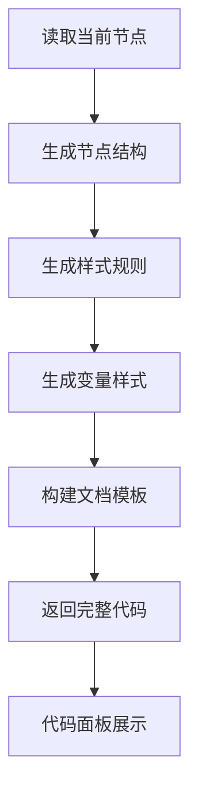
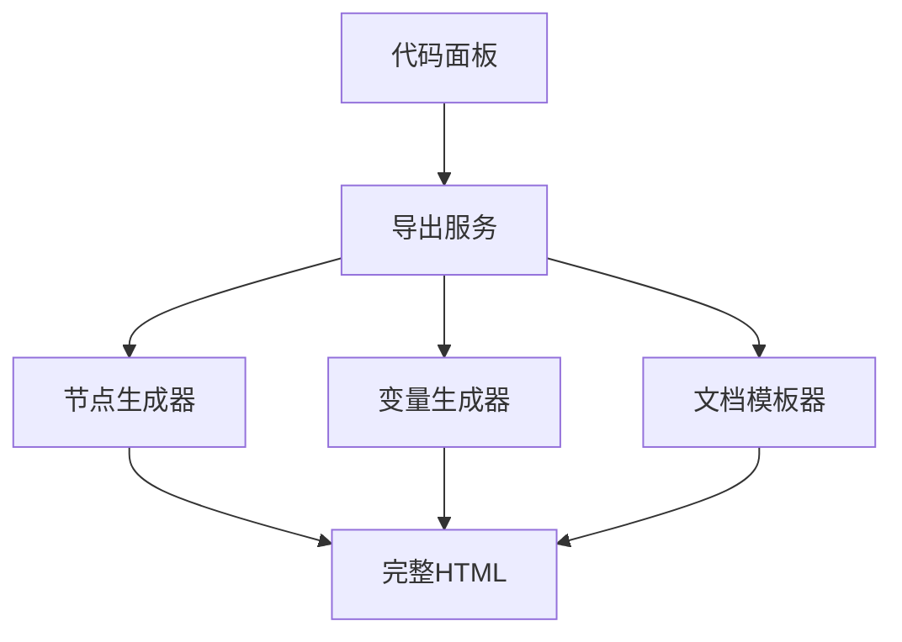

# HTML导出模板改造方案

## 方案目标

这份方案解决的是一个很具体的问题：

当前项目的 HTML 导出能力能用，但是“模板结构”和“节点生成逻辑”耦合在一起，后面如果你想改导出页面骨架、语义标签、样式包壳、变量注入方式，改起来会比较散。

这次方案的目标不是重写整套导出器，而是把它整理成：

1. 好找入口
2. 好改模板
3. 好加规则
4. 好写测试

## 先说结论

如果你要定制 HTML 导出模板，我建议优先改这四个位置：

1. `src/components/panels/code-panel.tsx`
2. `src/services/codegen/html-generator.ts`
3. `src/services/codegen/css-variables-generator.ts`
4. 新增一个模板拼装文件，比如 `src/services/codegen/html-document-builder.ts`

原因很简单：

- `code-panel.tsx` 现在负责把 `html` 和 `css` 包成完整文档
- `html-generator.ts` 现在负责把节点翻译成标签和样式
- `css-variables-generator.ts` 负责变量系统落地成 `:root`
- 缺少一个中间层来统一控制“最终 HTML 文档模板”

现在的结构像是“厨师一边炒菜，一边自己做盘子，还顺手印菜单”。能跑，但扩展起来不顺。

## 当前结构问题

### 一 代码包壳写死在面板层

现在 `src/components/panels/code-panel.tsx` 第 123 到 125 行，直接把内容拼成：

- `<!DOCTYPE html>`
- `<html lang="en">`
- `<head>`
- `<style>`
- `<body>`

问题是：

1. 页面标题写死成 `Design`
2. `lang` 写死成 `en`
3. 文档壳和节点生成是分开的，但没有正式抽象
4. 以后如果要加 `meta`、外链字体、全局 reset、主题属性，会继续堆在面板里

### 二 节点生成器职责过重

`src/services/codegen/html-generator.ts` 现在同时做了这些事：

1. 样式值转换
2. 节点递归遍历
3. 标签类型映射
4. CSS 规则汇总
5. 容器尺寸计算

这会导致一个问题：

你以后想改“模板结构”时，很容易误改到“节点翻译规则”。

### 三 文档级导出和节点级导出概念混在一起

现在有两个接口：

- `generateHTMLCode`
- `generateHTMLFromDocument`

但代码面板实际用的是 `generateHTMLCode`。

这说明当前导出偏向“局部节点即时代码预览”，不是“正式文档导出”。

如果后面要做：

- 页面级导出
- 组件级导出
- 多页面导出
- 带主题变量导出

这两个接口还要继续整理。

## 推荐改造思路

### 一 先拆成三层

建议把 HTML 导出拆成下面三层：

1. 节点翻译层
   - 负责 PenNode 到结构片段的转换

2. 文档模板层
   - 负责把 HTML 片段和 CSS 片段包成完整文档

3. 面板展示层
   - 负责在 UI 里切换标签 展示 复制 下载

### 二 推荐目标结构

建议新增或调整成下面这样：

```text
src/services/codegen/
  html-generator.ts
  html-document-builder.ts
  html-export-types.ts
  css-variables-generator.ts
```

职责建议如下：

`html-generator.ts`

- 输入节点
- 输出结构化结果
- 例如 `bodyHtml` `css` `usedFonts` `meta`

`html-document-builder.ts`

- 输入 `bodyHtml` `css` `title` `lang` `extraHead`
- 输出完整 HTML 文档字符串

`html-export-types.ts`

- 定义导出选项
- 比如 `title` `lang` `includeCssVariables` `includeReset` `semanticMode`

`code-panel.tsx`

- 只负责调用导出服务
- 不再手写文档壳字符串

## 推荐流程图

### 一 改造后的导出流程



### 二 推荐职责拆分流程



## 分阶段实施方案

## 第一阶段

目标是最小改动，把“文档模板壳”从 `code-panel.tsx` 里提出来。

### 需要改的文件

1. `src/components/panels/code-panel.tsx`
2. 新增 `src/services/codegen/html-document-builder.ts`
3. 可选新增 `src/services/codegen/html-export-types.ts`

### 改法

把现在这段写死字符串的逻辑：

- 文档类型
- html 标签
- head
- style
- body

统一搬到 `buildHTMLDocument` 这种函数里。

示意接口：

```ts
export interface HTMLDocumentBuildOptions {
  title?: string
  lang?: string
  css: string
  bodyHtml: string
  extraHead?: string[]
}

export function buildHTMLDocument(options: HTMLDocumentBuildOptions): string
```

### 收益

1. `code-panel.tsx` 会变薄
2. 导出壳模板集中管理
3. 后面加 meta 字段不用改面板 UI

### 风险

风险很低，属于安全重构。

## 第二阶段

目标是把 `html-generator.ts` 从“大杂烩”拆成更清楚的结构。

### 需要改的文件

1. `src/services/codegen/html-generator.ts`
2. 可选新增 `src/services/codegen/html-node-renderer.ts`
3. 可选新增 `src/services/codegen/html-style-helpers.ts`

### 改法

把 `html-generator.ts` 里的逻辑拆成三类：

1. 样式工具函数
   - `fillToCSS`
   - `strokeToCSS`
   - `effectsToCSS`
   - `cornerRadiusToCSS`
   - `layoutToCSS`

2. 节点标签渲染
   - `generateNodeHTML`

3. 页面级包装
   - `generateHTMLCode`
   - `generateHTMLFromDocument`

### 建议新增导出结果类型

```ts
export interface HTMLExportResult {
  bodyHtml: string
  css: string
  width?: number
  height?: number
}
```

这样后面不只是面板能用，正式导出功能也能直接复用。

### 收益

1. 模板层和节点层边界更清楚
2. 后面更容易做语义标签映射
3. 以后做 SSR 模板或邮件模板也更方便切换

### 风险

中等风险。

因为递归生成部分一旦拆错，容易影响：

- 类名顺序
- CSS 顺序
- 文本标签类型
- 图片和路径节点输出

所以第二阶段一定要跟测试一起做。

## 第三阶段

目标是让 HTML 导出支持“模板可配置”。

### 建议新增的配置项

```ts
export interface HTMLExportOptions {
  title?: string
  lang?: string
  includeCssVariables?: boolean
  includeDocumentShell?: boolean
  includeResetStyles?: boolean
  semanticMode?: 'basic' | 'enhanced'
}
```

### 可以支持的能力

1. 自定义标题
2. 自定义页面语言
3. 是否输出完整 HTML 文档
4. 是否注入 CSS 变量
5. 是否附带基础 reset
6. 是否启用语义化标签策略

### 为什么要做这层

因为你后面一定会遇到这种需求：

- 我只想导出一段 body 片段
- 我想导出可直接跑的整页 HTML
- 我想导出带主题变量的版本
- 我想导出更语义化的结构

如果没有 `HTMLExportOptions`，这些判断就会散落在组件里。

## 第四阶段

目标是提高导出结果的可读性和语义质量。

### 建议改造点

1. 基于 `node.role` 决定标签
2. 容器节点支持更语义化标签
3. 文本节点标签不要只按字号判断

### 具体建议

当前文本节点大致是：

- 大字号变 `h1`
- 中字号变 `h2`
- 再小一点变 `h3`
- 其他变 `p`

这是一种“视觉猜测”，不是“语义判断”。

建议改成优先级：

1. 先看 `node.role`
2. 再看节点名称关键词
3. 最后再用字号兜底

比如：

- `role = heading` 优先出标题标签
- `role = button` 优先出 `button`
- `role = navigation` 优先出 `nav`
- `role = section` 优先出 `section`

### 类比理解

现在的导出器像“看衣服尺寸猜职业”。

- 穿西装就猜经理
- 背书包就猜学生

有时候能猜对，但本质不稳定。

更合理的是看工牌，也就是 `node.role`。

## 第五阶段

目标是补齐测试。

### 建议新增测试文件

1. `src/services/codegen/__tests__/html-generator.test.ts`
2. `src/services/codegen/__tests__/html-document-builder.test.ts`

### 测试重点

1. 空节点导出是否稳定
2. 文本节点是否正确转义
3. 图片节点是否正确输出 `img`
4. 路径节点是否正确输出 `svg`
5. 变量引用是否正确转成 `var`
6. 布局属性是否正确生成 flex 样式
7. 文档壳是否正确包含 `DOCTYPE` `head` `style` `body`

### 运行方式

项目当前测试脚本是：

```bash
bun --bun vitest run --passWithNoTests
```

如果只跑 HTML 导出测试，后续可以用：

```bash
bun --bun vitest run html-generator
```

## 推荐改动顺序

建议按下面顺序做，不要一口气把生成器全改掉。

1. 先抽文档模板层
2. 再抽导出配置类型
3. 再拆节点生成器内部结构
4. 再做语义化标签增强
5. 最后补测试和回归验证

这个顺序的好处是：

- 前两步低风险
- 中间两步解决扩展性
- 最后一步兜底质量

## 最小可落地版本

如果你现在要最快见效果，我建议先做一个最小版本：

### 只做这三件事

1. 新建 `html-document-builder.ts`
2. 把 `code-panel.tsx` 里的 HTML 外壳拼接迁进去
3. 给 `generateHTMLCode` 加一个统一结果类型

### 这样改完后你马上能得到什么

1. 能单独改导出页面标题
2. 能单独改导出语言
3. 能单独改 `head` 内容
4. 后面要加 reset 和字体引入会更顺

这是性价比最高的一刀。

## 中期增强版本

如果你准备把它做成长期能力，建议继续加下面两项：

1. 角色驱动的语义标签映射
2. HTML 导出测试集

因为这两项决定的不是“能不能导出”，而是“导出的代码像不像人写的”。

## 我建议你下一步直接实施的文件

如果下一步要我直接改代码，我建议按下面文件开始：

1. `src/services/codegen/html-document-builder.ts`
2. `src/components/panels/code-panel.tsx`
3. `src/services/codegen/html-generator.ts`
4. `src/services/codegen/__tests__/html-generator.test.ts`

## 最终判断

这次改造最关键的不是“再加一个模板字符串”，而是把当前导出能力从“拼接代码”升级成“有边界的导出模块”。

一句话总结：

- `code-panel.tsx` 不该继续负责模板壳
- `html-generator.ts` 不该一个文件吃掉所有导出职责
- 应该补一个“文档模板构建层”
- 应该尽快补一组导出回归测试

这样后面你想改导出结构时，就像换门板，不是拆整栋房子。

## 参考链接

- MDN Using CSS custom properties https://developer.mozilla.org/en-US/docs/Web/CSS/Guides/Cascading_variables/Using_custom_properties
- MDN Basic concepts of flexbox https://developer.mozilla.org/docs/Web/CSS/CSS_Flexible_Box_Layout/Basic_Concepts_of_Flexbox
- MDN Semantics https://developer.mozilla.org/en-US/docs/Glossary/Semantics
- Vitest Getting Started https://vitest.dev/guide/
