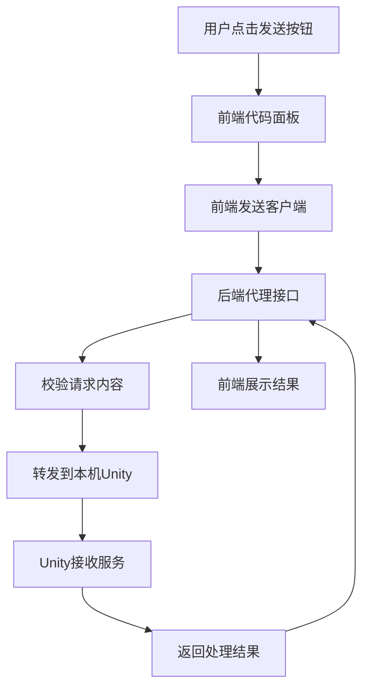
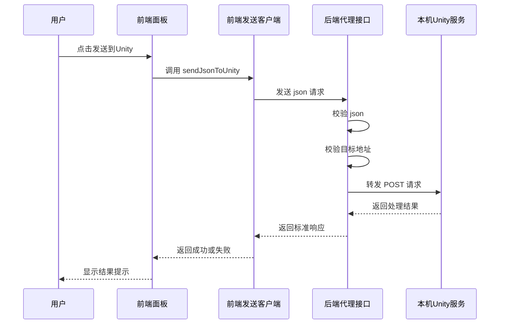

# OpenPencil 后端转发到 Unity 链路梳理

## 文档目的

这份文档只梳理一条很具体的链路：

`HTML 导出` -> `HTML 转 JSON` -> `后端代理` -> `本机 Unity 服务`

重点回答下面几个问题：

1. 后端转发到 Unity 的入口写在哪里
2. 前端和后端分别负责什么
3. 后端代理到底做了哪些校验和转发
4. 失败时错误是怎么往前传回来的

## 一句话结论

OpenPencil 里“发到 Unity”这件事不是纯前端，也不是纯后端。

它的真实分工是：

1. 前端负责把 HTML 烘焙成 Unity 需要的 JSON
2. 前端再把这份 JSON 发给本项目自己的后端接口
3. 后端接口只做代理转发和安全校验
4. 真正消费 JSON 并生成 UGUI 的，是本机运行的 Unity 服务

可以把它理解成：

- 前端像制图员，先把图纸整理成标准格式
- 后端像门卫和转接台，检查格式和目标地址后再放行
- Unity 服务才是真正进场施工的人

## 核心入口

| 模块 | 文件 | 作用 |
| --- | --- | --- |
| HTML 面板触发 | `src/components/panels/code-panel.tsx` | 点击按钮，先做 HTML 转 JSON，再触发发送到 Unity |
| 前端发送客户端 | `src/services/codegen/unity-bake-client.ts` | 把 JSON 以 POST 方式发送到 `/api/unity/ugui-bake` |
| 后端代理接口 | `server/api/unity/ugui-bake.post.ts` | 校验 JSON 和目标地址，再转发到本机 Unity 服务 |
| 浏览器烘焙器 | `src/services/codegen/html-to-json-baker.ts` | 在浏览器里读取布局和坐标，生成 Unity JSON |

## 调用链总览

```text
用户点击发送到Unity
  -> code panel 调用 handleSendToUnity
  -> sendJsonToUnity
  -> POST /api/unity/ugui-bake
  -> 后端校验 json 和 url
  -> 后端 fetch 到本机 Unity 服务
  -> Unity 服务返回结果
  -> 后端把结果包装后返回前端
  -> 前端显示成功或失败提示
```

## 总体流程图



## 时序图



## 前端和后端如何分工

### 前端负责什么

前端负责两件事。

#### 第一件事 把 HTML 烘焙成 JSON

这一步在：

- `src/services/codegen/html-to-json-baker.ts`

核心职责是：

1. 在浏览器里创建隐藏 `iframe`
2. 把导出的 HTML 写进去
3. 读取 DOM 的实际布局和尺寸
4. 提取 `data-u-type` `data-u-name` 等 Unity DSL 标记
5. 生成 Unity 可消费的 JSON 结构

这一步必须在前端做，因为它依赖：

1. `window`
2. `document`
3. `iframe`
4. `getBoundingClientRect`
5. `getComputedStyle`

也就是说，这部分本质上是浏览器布局测量，不是后端逻辑。

#### 第二件事 把 JSON 发给后端代理

这一步在：

- `src/services/codegen/unity-bake-client.ts`

`sendJsonToUnity()` 做的事很简单：

1. 调用 `fetch('/api/unity/ugui-bake')`
2. 请求方法是 `POST`
3. 请求头是 `application/json`
4. 请求体是 `{ json }`
5. 把后端返回结果解析为统一的 `UnityBakeResponse`

对应代码位置：

- `src/services/codegen/unity-bake-client.ts:28-39`

### 后端负责什么

后端这一层不负责生成 UI，也不负责理解 HTML 布局。

它只负责三类事情：

1. 入参校验
2. 转发到本机 Unity 服务
3. 统一返回成功或失败结果

所以它更接近“代理层”，不是“渲染层”。

## 后端代理入口在哪里

真正的后端入口在：

- `server/api/unity/ugui-bake.post.ts`

默认的 Unity 转发目标是：

```text
http://127.0.0.1:7777/
```

对应代码位置：

- `server/api/unity/ugui-bake.post.ts:8`

这说明当前设计不是让前端直接访问 Unity，而是统一先经过 OpenPencil 自己的后端接口再转发。

## 后端代码逻辑拆解

### 第一步 读取请求体

后端先通过 `readBody<ProxyBakeBody>(event)` 读取请求体。

请求体结构是：

```ts
interface ProxyBakeBody {
  json: string
  url?: string
}
```

这里的 `json` 是前端已经烘焙好的 JSON 字符串，不是对象。

对应代码位置：

- `server/api/unity/ugui-bake.post.ts:3-6`
- `server/api/unity/ugui-bake.post.ts:77`

### 第二步 校验 JSON 内容

后端不会直接相信前端发来的 `json`。

它会先走：

- `validateUnityBakeJson(json)`

这一步会检查：

1. `json` 字段是否存在
2. 是否是合法 JSON
3. 解析后是否是对象
4. 是否不是数组

如果失败，会直接返回 `400`。

这一步很像快递站先检查包裹是不是空盒子。
如果盒子本身就是坏的，后面就不该继续送。

对应代码位置：

- `server/api/unity/ugui-bake.post.ts:43-72`
- `server/api/unity/ugui-bake.post.ts:78-84`

### 第三步 校验目标地址

后端还会走：

- `resolveUnityBakeTarget(url)`

这一步的意义非常关键。

它不是简单拿到一个 URL 就去转发，而是限制：

1. 只允许 `http` 或 `https`
2. 只允许回环地址
3. 只允许 `localhost`
4. 只允许 `127.x.x.x`
5. 只允许 `::1`

换句话说，这个接口只允许把请求发到本机 Unity 服务，不允许把它变成任意外网代理。

这相当于门卫不只看你有没有票，还要看你是不是去本楼。

对应代码位置：

- `server/api/unity/ugui-bake.post.ts:9-17`
- `server/api/unity/ugui-bake.post.ts:19-41`
- `server/api/unity/ugui-bake.post.ts:86-92`

### 第四步 转发到本机 Unity

只有 JSON 和 URL 都通过校验后，后端才会真正发起转发：

```ts
const response = await fetch(targetResult.url, {
  method: 'POST',
  headers: {
    'Content-Type': 'application/json; charset=utf-8',
  },
  body: jsonResult.value,
})
```

这里可以看出两个关键点：

1. 后端转发的是已经校验过的原始 JSON 字符串
2. 后端自己不修改 JSON 结构

也就是说，后端不是“重新组装 Unity 数据”，而是“安全地把前端产物交给 Unity”。

对应代码位置：

- `server/api/unity/ugui-bake.post.ts:95-101`

### 第五步 规范化 Unity 返回结果

Unity 返回的内容不一定总是最理想的。

后端这里做了一个统一适配层：

1. 先读 `response.text()`
2. 尝试 `JSON.parse`
3. 如果解析失败，就把原始文本包装成统一 JSON 结构

这一步的目的是让前端尽量总能拿到一个可处理的 JSON 结果，而不是直接炸在 `response.json()`。

对应代码位置：

- `server/api/unity/ugui-bake.post.ts:103-118`

### 第六步 网络失败时返回 502

如果后端根本连不上 Unity 服务，比如：

1. Unity 没启动
2. 端口没监听
3. 本机服务异常退出

那么这里会走 `catch`，并返回：

- `502`
- `success: false`
- `message: 无法连接到 Unity 服务` 或具体错误信息

这一步的意义是把“后端到 Unity”之间的故障，明确标记为代理层故障，而不是前端烘焙失败。

对应代码位置：

- `server/api/unity/ugui-bake.post.ts:120-126`

## 前端按钮是怎么接到这条链路上的

真正触发“发到 Unity”的按钮逻辑在：

- `src/components/panels/code-panel.tsx`

对应的关键函数是：

1. `handleBakeJSON()`
2. `handleSendToUnity()`

流程是：

1. 先把当前 HTML 烘焙成 JSON
2. 把 JSON 放进 `bakedJsonCode`
3. 用户再点击发送按钮
4. 调用 `sendJsonToUnity(bakedJsonCode)`
5. 把返回的 `canvasName` `rootName` 或错误消息展示在 UI 上

对应代码位置：

- `src/components/panels/code-panel.tsx:261-287`
- `src/components/panels/code-panel.tsx:289-307`

## 这条链路和 AI 聊天主链路的关系

这条 Unity 转发链路和 `/api/ai/chat` 那条主链不是同一件事。

两者区别非常大：

### AI 聊天主链

用途是：

1. 对话
2. 设计生成
3. Orchestrator
4. SubAgent
5. 模型流式返回

### Unity 转发链

用途是：

1. 接收前端已经烘焙好的 JSON
2. 转发给本机 Unity
3. 返回 Unity 的处理结果

所以更准确地说：

- `/api/ai/chat` 是模型调用链
- `/api/unity/ugui-bake` 是 Unity 工具链接口

它们都是后端接口，但不是同一层职责。

## 后端代理的边界和风险控制

这条代理链当前已经做了三层边界控制。

### 边界一 只允许对象 JSON

防止：

1. 空字符串
2. 非 JSON 文本
3. 数组
4. 无意义负载

### 边界二 只允许本机地址

防止：

1. 被当成任意 HTTP 代理
2. 把请求打到外部地址
3. 形成不必要的 SSRF 风险

### 边界三 非 JSON 响应也统一包装

防止：

1. 前端直接因为 `response.json()` 崩掉
2. Unity 返回纯文本时前端无法给出可读提示

## 当前返回结果是什么样

前端最终期望拿到的是：

```ts
interface UnityBakeResponse {
  success: boolean
  canvasName?: string
  rootName?: string
  message: string
}
```

这意味着无论 Unity 返回得多复杂，前端 UI 最终只关心：

1. 成功还是失败
2. 目标画布名
3. 根节点名
4. 提示文本

这就是典型的接口收口。

前端像收银台，不想知道后厨每个锅怎么动，只想知道“这单成了没，成了放哪桌”。

## 当前测试覆盖

这条链路相关的测试主要有三组。

### 一 前端发送客户端测试

文件：

- `src/services/codegen/unity-bake-clientExample.test.ts`

覆盖点：

1. 正常发送成功
2. 后端返回失败
3. 后端返回非 JSON 文本

### 二 浏览器烘焙器测试

文件：

- `src/services/codegen/html-to-json-bakerExample.test.ts`

覆盖点：

1. 根节点识别
2. 结构告警
3. 颜色转换
4. 容器文本提取边界
5. 控件文本提取边界

### 三 后端代理路由测试

文件：

- `server/__tests__/unity-bake-route.test.ts`

覆盖点：

1. 允许本机地址
2. 拒绝非本机地址
3. 拒绝无效 JSON
4. 正常转发到 Unity
5. 把 Unity 的非 JSON 响应转成统一 JSON 返回

## 一句话记住这条链路

如果只记一句话，最准确的是：

OpenPencil 前端负责把 HTML 烘焙成 Unity JSON，后端只负责校验并代理转发到本机 Unity 服务，真正处理 UGUI 的逻辑不在 OpenPencil 后端内部。

## 引用说明

以下链接用于补充文档里提到的 `fetch` `SSE` 和 H3 事件处理这些通用技术背景：

1. MDN Using the Fetch API  
   https://developer.mozilla.org/en-US/docs/Web/API/Fetch_API/Using_Fetch

2. MDN Window fetch method  
   https://developer.mozilla.org/en-US/docs/Web/API/Window/fetch

3. MDN Using server sent events  
   https://developer.mozilla.org/en-US/docs/Web/API/Server-sent_events/Using_server-sent_events

4. H3 Event Handlers  
   https://h3.dev/guide/basics/handler

5. H3 H3Event  
   https://h3.dev/guide/api/h3event
