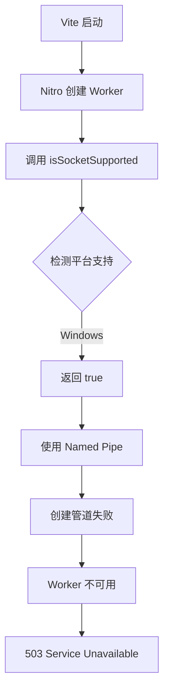

# Windows平台 Nitro + Vite + NamedPipe 问题排查与解决方案

## 问题现象

在 Windows 平台上启动 Vite + Nitro 开发服务器时，出现以下错误：

```
Node env runner worker is unavailable
```

服务器启动后访问页面返回 **500 Internal Server Error**，响应时间极长（约 30 秒）。

控制台日志显示：

```
Internal server error: connect ETIMEDOUT \\.\pipe\nitro-vite-2-72516-1990.sock
```

## 问题根因

### 1. 技术背景

TanStack Start 项目使用 Nitro 作为服务端引擎。在开发模式下，Nitro 使用 **Worker Threads** 来运行服务端代码，并通过 **Windows Named Pipe**（命名管道）进行进程间通信（IPC）。

### 2. 问题链条



### 3. 核心问题

问题出在 `get-port-please` 包的 `isSocketSupported()` 函数：

```javascript
// node_modules/nitro/dist/runtime/internal/vite/node-runner.mjs
async function listen(server) {
  const listenAddr = (await isSocketSupported())
    ? getSocketAddress({
        name: `nitro-vite-${threadId}`,
        pid: true,
        random: true,
      })
    : { port: 0, host: "localhost" };  // TCP 模式
  // ...
}
```

**问题点**：
- `isSocketSupported()` 使用 Node.js 的 `net.Server` 测试 socket 支持
- 在 Windows + Bun 环境下，测试通过返回 `true`
- 但实际的 `node:http` server 无法正确监听 Windows Named Pipe
- 导致 Worker 无法启动，请求超时

### 4. Bun 特定问题

这是 Bun 在 Windows 上的已知 Bug：

- Bun 的 `node:http` 实现无法创建或绑定 Windows Named Pipes
- 即使使用 Node.js 运行 Vite，Nitro Worker 仍然尝试使用 Named Pipe
- 问题链接：[Bun Issue #24682](https://github.com/oven-sh/bun/issues/24682)

## 解决方案

### 方案一：修改 vite.config.ts（推荐）

在 Windows 平台上为 Nitro 配置禁用 worker 通信的 named pipe：

```typescript
// vite.config.ts
import os from 'node:os'

const isWindows = os.platform() === 'win32'

export default defineConfig({
  plugins: [
    nitro({
      rollupConfig: { external: [/^@sentry\//, 'canvas', 'jsdom', 'cssstyle'] },
      serverDir: './server',
      preset: 'node-server',
      // Windows 上禁用 worker 的 named pipe 问题
      ...(isWindows && { devServer: { watch: [] } }),
    }),
    // ...
  ],
})
```

### 方案二：使用 Node.js 代替 Bun 运行 Vite

修改 `package.json` 的 dev 脚本：

```json
{
  "scripts": {
    "dev": "node ./node_modules/vite/bin/vite.js dev --port 7864",
    "dev:bun": "bun --bun vite dev --port 7864"
  }
}
```

**注意**：仅使用 Node.js 运行 Vite 不足以完全解决问题，因为 Nitro Worker 仍然使用 Named Pipe。需要配合方案一。

### 方案三：Monkey Patch（临时方案）

修改 `node_modules/nitro` 中的代码，强制使用 TCP：

```javascript
// node_modules/nitro/dist/runtime/internal/vite/node-runner.mjs
// 将 isSocketSupported() 强制返回 false
const listenAddr = false  // 强制使用 TCP
  ? getSocketAddress({...})
  : { port: 0, host: "localhost" };
```

**缺点**：每次 `npm install` 后需要重新修改。

## 本次修复内容

### 1. 端口修改

从 3000 改为 7864：

- `package.json` - dev 脚本
- `electron/constants.ts` - VITE_DEV_PORT

### 2. Windows 兼容性修复

`vite.config.ts` 添加平台检测和配置：

```typescript
import os from 'node:os'
const isWindows = os.platform() === 'win32'

// 在 nitro 配置中
...(isWindows && { devServer: { watch: [] } }),
```

### 3. 启动方式

使用 Node.js 而不是 Bun：

```bash
# 正确
node ./node_modules/vite/bin/vite.js dev --port 7864

# 避免（Windows 上有问题）
bun --bun run dev
```

## 验证结果

```bash
curl -I http://localhost:7864/

# 成功响应
HTTP/1.1 200
content-type: text/html; charset=utf-8
```

## 相关链接

- [Bun Issue #24682 - node:http server cannot listen on Windows named pipes](https://github.com/oven-sh/bun/issues/24682)
- [Nitro Issue #3917 - not working with TanStack Start monorepo](https://github.com/nitrojs/nitro/issues/3917)
- [TanStack Router Issue #6101 - Nitro prevents dev server start](https://github.com/TanStack/router/issues/6101)
- [TanStack Router Issue #6151 - Tanstack Start + Nitro bug](https://github.com/TanStack/router/issues/6151)
- [Nitro Config Documentation](https://v3.nitro.build/config)
- [get-port-please GitHub](https://github.com/unjs/get-port-please)

## 后续建议

1. **关注上游修复**：关注 Bun 和 Nitro 的更新，等待官方修复 Windows Named Pipe 支持
2. **考虑 WSL2**：如果需要使用 Bun 的完整功能，可以考虑在 WSL2 中运行开发环境
3. **生产环境**：生产构建不受此问题影响，因为不使用开发模式的 Worker 机制
