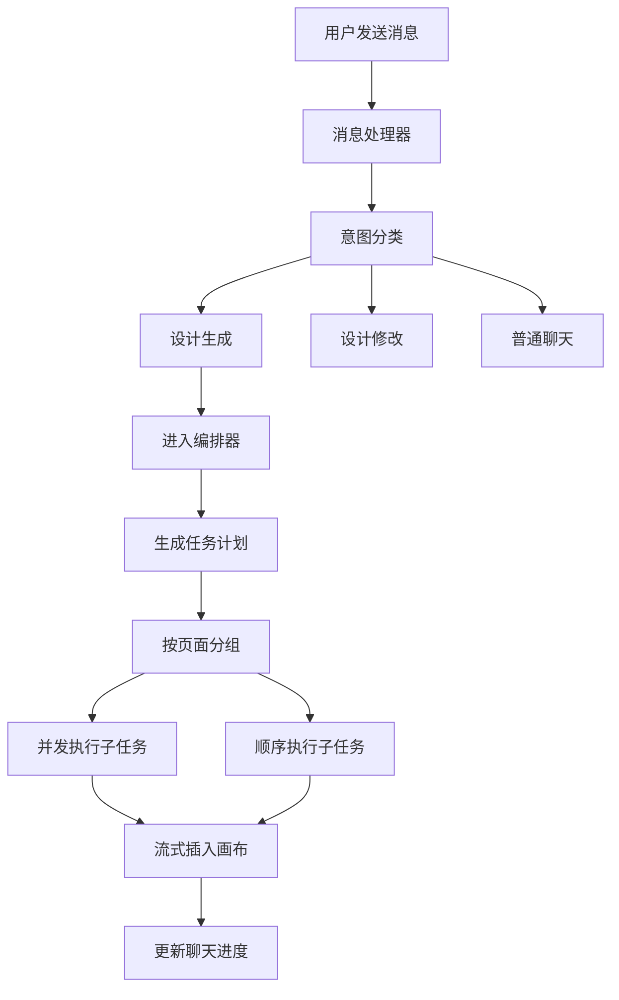
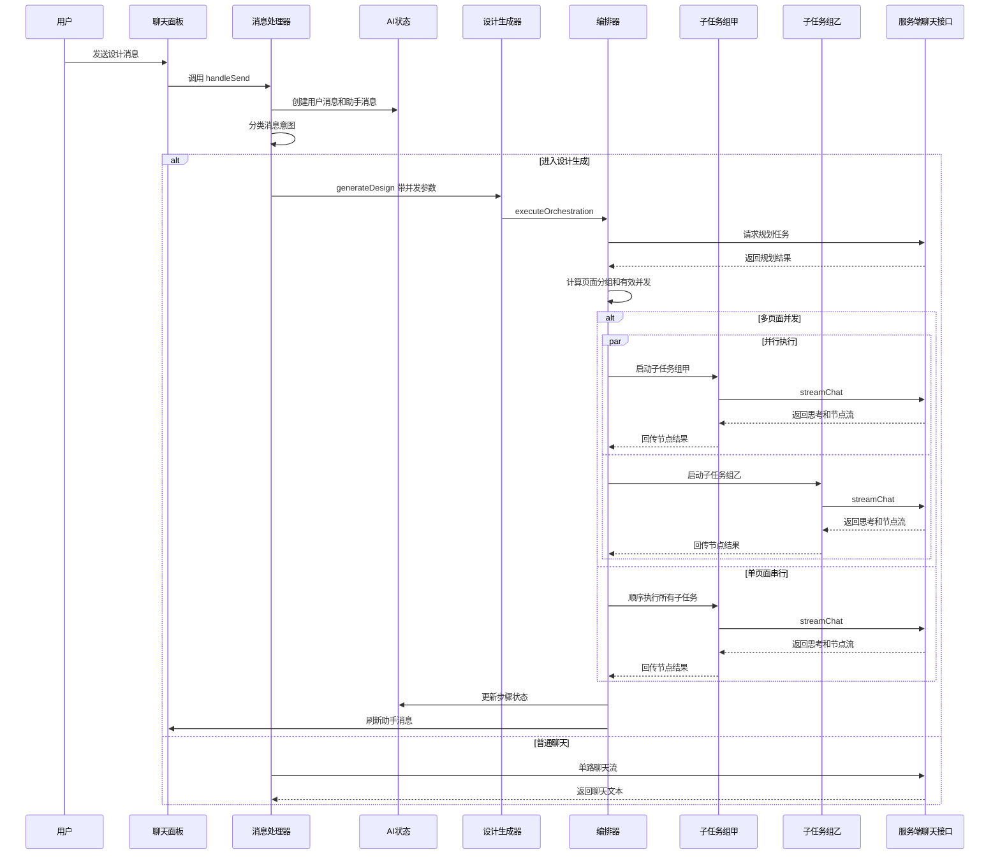
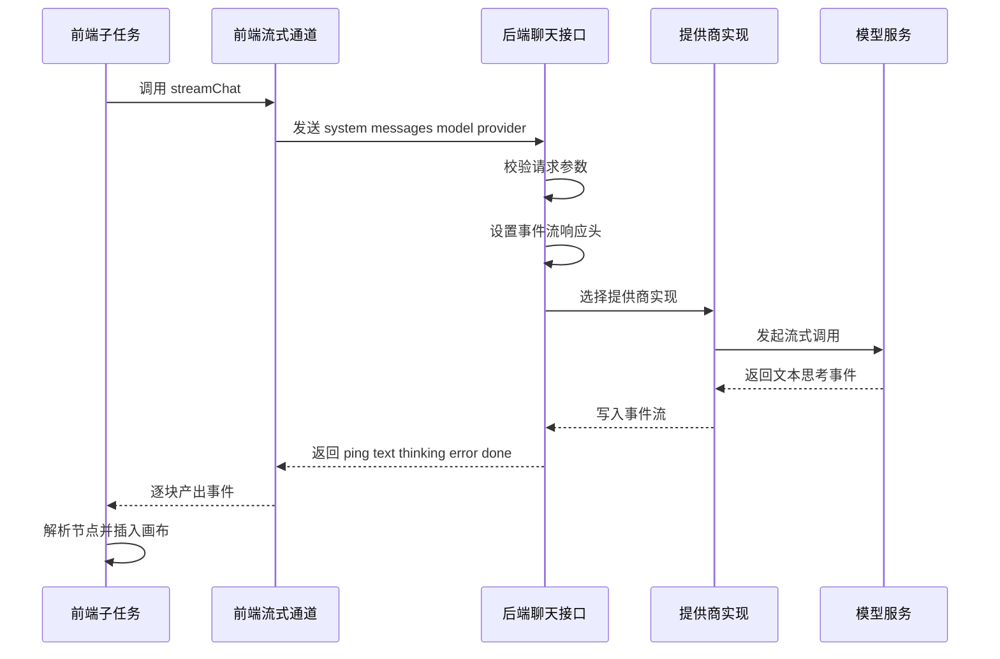
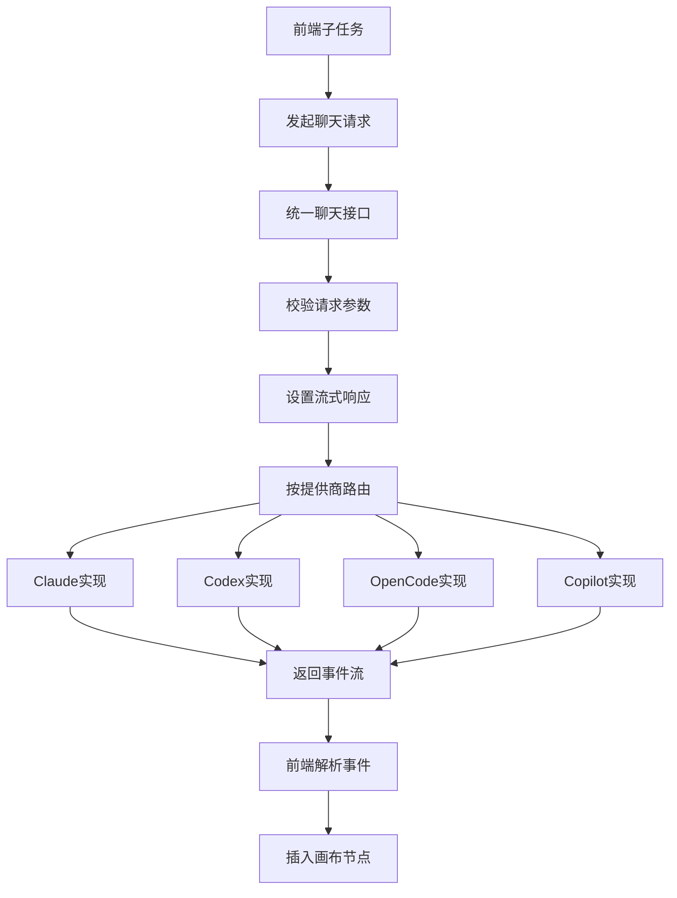
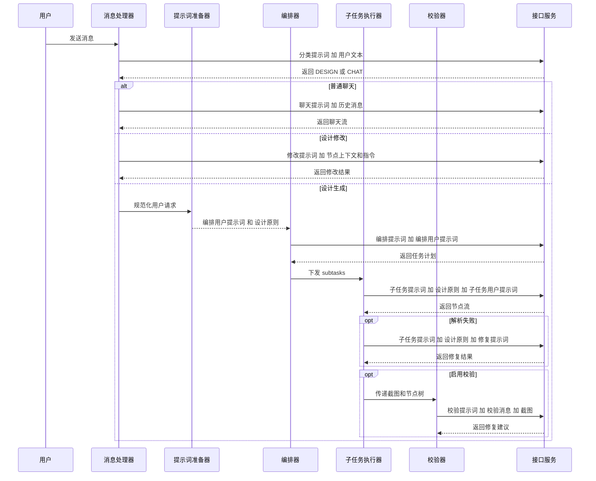
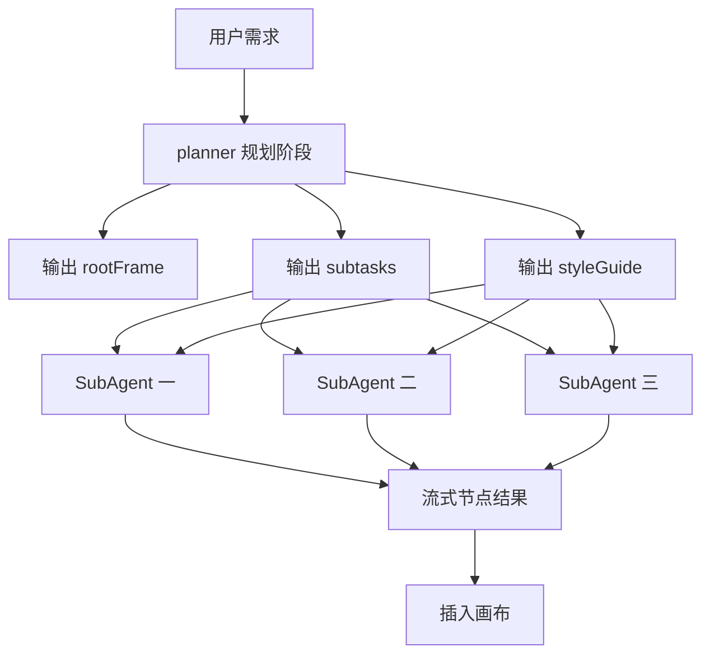
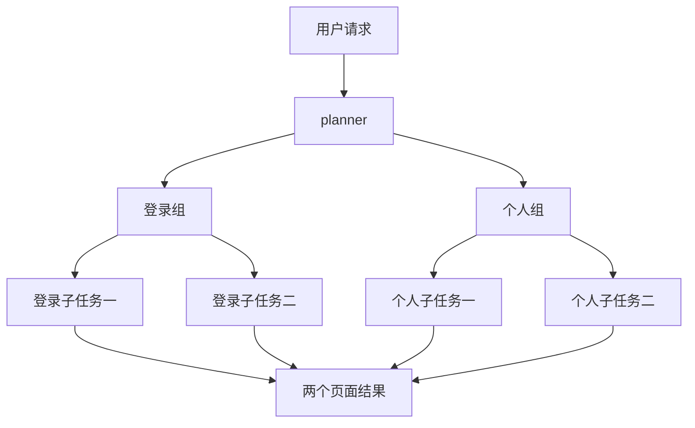

# OpenPencil 消息处理与多个 SubAgent 任务启动机制分析

## 文档目的

本文整理 OpenPencil 在处理一条 AI 消息时，如何判断是否进入设计生成链路、如何触发 Orchestrator、以及在什么条件下真正启动多个 SubAgent 任务并行工作。

文档重点回答三个问题：

1. 消息从哪里进入设计生成链路
2. 多个 SubAgent 是如何被启动的
3. 为什么有时候设置了更高并发，但实际仍然是串行执行

## 一句话结论

OpenPencil 里的多个 SubAgent 不是操作系统层面的多个独立进程，也不是单独的本地 agent 容器。

它的本质是：

1. 前端先把用户消息识别为设计生成任务
2. Orchestrator 先向模型请求一份任务规划
3. 规划结果被拆成多个 `subtasks`
4. 只有当这些 `subtasks` 被规划成多个不同的 `screen` 分组时，系统才会按 `concurrency` 启动多路并发的 `streamChat()` 请求
5. 每一路请求都相当于一个 SubAgent，在同一个前端运行时中并发执行，并把生成结果流式插回画布
6. 后端并不会额外维护一套 SubAgent 调度器，它只是把每一路请求当成普通的 `/api/ai/chat` 流式会话，按 `provider` 路由到具体实现再把 SSE 事件流回前端

可以把它理解成：

- `ai-chat-handlers.ts` 是接单员
- `orchestrator.ts` 是总包项目经理
- `orchestrator-sub-agent.ts` 是分包调度器
- 每个 `executeSubAgent()` 是一个具体施工班组

## 核心代码入口

| 模块 | 文件 | 作用 |
| --- | --- | --- |
| 消息入口 | `src/components/panels/ai-chat-handlers.ts` | 处理发送消息后的总入口，决定走聊天、设计生成还是设计修改 |
| 并发按钮 | `src/components/panels/ai-chat-panel.tsx` | UI 上的 `1x` 到 `6x` 并发切换 |
| 并发状态 | `src/stores/ai-store.ts` | 保存 `concurrency`，并限制范围为 `1` 到 `6` |
| 设计生成入口 | `src/services/ai/design-generator.ts` | `generateDesign()` 转调 `executeOrchestration()` |
| 总编排器 | `src/services/ai/orchestrator.ts` | 先规划任务，再决定并发还是串行执行 |
| 编排提示词 | `src/services/ai/orchestrator-prompts.ts` | 定义 `ORCHESTRATOR_PROMPT` 和 `SUB_AGENT_PROMPT`，前者负责拆任务，后者负责生成节点 |
| 子任务执行器 | `src/services/ai/orchestrator-sub-agent.ts` | 真正执行多个 SubAgent，包含并发控制和流式插画布 |
| 流式 AI 通道 | `src/services/ai/ai-service.ts` | `streamChat()` 通过 `/api/ai/chat` 与后端建立流式会话 |
| 服务端路由 | `server/api/ai/chat.ts` | 按 provider 把请求路由到 Claude OpenAI OpenCode Copilot |

## 提示词总览

下面这张表列出当前这条“消息处理到多个 SubAgent 执行”链路里真正会参与运行的提示词，以及它们分别处于哪个阶段。

| 提示词或提示词结果 | 文件 | 阶段 | 类型 | 作用 |
| --- | --- | --- | --- | --- |
| `CLASSIFY_PROMPT` | `src/components/panels/ai-chat-handlers.ts` | 消息路由 | system prompt | 判断本条消息是设计任务还是普通聊天 |
| `CHAT_SYSTEM_PROMPT` | `src/services/ai/ai-prompts.ts` | 普通聊天分支 | system prompt | 约束聊天回答格式，必要时输出 PenNode JSON |
| `DESIGN_MODIFIER_PROMPT` | `src/services/ai/ai-prompts.ts` | 设计修改分支 | system prompt | 要求基于现有节点做定向修改，并尽量保留原 ID |
| `ORCHESTRATOR_PROMPT` | `src/services/ai/orchestrator-prompts.ts` | 规划阶段 | system prompt | 先把用户需求拆成 `rootFrame` `styleGuide` `subtasks` |
| `preparedPrompt.orchestratorPrompt` | `src/services/ai/orchestrator-prompt-optimizer.ts` | 规划阶段 | user prompt | 对原始用户需求做规范化和长度裁剪，供 planner 使用 |
| `SUB_AGENT_PROMPT` | `src/services/ai/orchestrator-prompts.ts` | 子任务生成阶段 | system prompt | 要求单个 SubAgent 输出 PenNode JSONL |
| `preparedPrompt.designPrinciples` | `src/services/ai/design-principles/index.ts` | 子任务生成阶段 | system prompt 追加内容 | 给 SubAgent 注入压缩后的设计原则 |
| `buildSubAgentUserPrompt()` 结果 | `src/services/ai/orchestrator-sub-agent.ts` | 子任务生成阶段 | user prompt | 明确当前 SubAgent 负责哪个区块、有哪些元素、有哪些布局限制 |
| `buildSubAgentRepairPrompt()` 结果 | `src/services/ai/orchestrator-sub-agent.ts` | 子任务修复阶段 | user prompt | 当第一次输出不可解析时，要求同一 SubAgent 重新发出结构化 JSON |
| `VALIDATION_SYSTEM_PROMPT` | `src/services/ai/design-validation.ts` | 后置校验阶段 | system prompt | 基于截图和节点树识别视觉问题并输出修复建议 |

为了避免混淆，还需要单独说明几个“存在但不在当前多 SubAgent 主链路里执行”的提示词：

| 提示词 | 文件 | 当前多 SubAgent 主链路是否使用 | 说明 |
| --- | --- | --- | --- |
| `DESIGN_GENERATOR_PROMPT` | `src/services/ai/ai-prompts.ts` | 否 | 这是旧的单路设计生成提示词，当前 `generateDesign()` 已改为走 `executeOrchestration()` |
| `DESIGN_SYSTEM_PROMPT` | `src/services/ai/design-system-prompts.ts` | 否 | 这是 visual reference 管线里用于先生成设计系统 token 的提示词 |
| `DESIGN_CODE_SYSTEM_PROMPT` | `src/services/ai/design-code-prompts.ts` | 否 | 这是 visual reference 管线里用于生成 HTML 视觉参考的提示词 |
| `CODE_GENERATOR_PROMPT` | `src/services/ai/ai-prompts.ts` | 否 | 这是把 PenNode 转成代码时使用的提示词，不参与当前消息到 SubAgent 的生成链路 |

## 总体调用链

```text
用户发送消息
  -> useChatHandlers handleSend
  -> classifyIntent
  -> generateDesign
  -> executeOrchestration
  -> callOrchestrator
  -> 得到 plan subtasks
  -> 计算 effectiveConcurrency
  -> executeSubAgents
  -> 多路 executeSubAgent
  -> streamChat
  -> /api/ai/chat
  -> 模型流式返回
  -> 解析节点
  -> 插入画布
  -> 回写聊天消息进度
```

## 总体流程图



## 时序图



## 详细逻辑梳理

### 1 消息从哪里进入

主入口在 `src/components/panels/ai-chat-handlers.ts` 的 `handleSend()`。

关键逻辑如下：

1. 读取输入文本和附件
2. 在 Zustand store 中先插入一条用户消息，再插入一条空的助手消息
3. 创建 `AbortController`
4. 调用 `classifyIntent()` 判断本次消息更像设计请求还是普通聊天
5. 根据结果进入三条分支

三条分支分别是：

1. 设计修改模式
   条件是 `isDesign && hasSelection`
   走 `generateDesignModification()`
   这是单路调用，不会启动多个 SubAgent

2. 设计生成模式
   条件是 `isDesign && !hasSelection`
   走 `generateDesign()`
   这是本文讨论的多 SubAgent 主链路

3. 普通聊天模式
   走 `streamChat()`
   也是单路流式聊天，不会触发 Orchestrator

对应源码位置：

- `src/components/panels/ai-chat-handlers.ts:255-263`
- `src/components/panels/ai-chat-handlers.ts:266-341`
- `src/components/panels/ai-chat-handlers.ts:342-435`

#### 1.1 消息路由阶段的提示词

在真正进入设计生成之前，系统先用一个很轻量的分类提示词决定本次消息走哪条分支。

这个提示词就是：

- `CLASSIFY_PROMPT`
- 文件位置：`src/components/panels/ai-chat-handlers.ts`

它的职责很单纯：

1. 只判断消息意图
2. 只输出 `DESIGN` 或 `CHAT`
3. 不负责生成任何设计内容

对应的调用方式是：

1. `handleSend()` 调用 `classifyIntent()`
2. `classifyIntent()` 使用 `/api/ai/generate`
3. 把 `CLASSIFY_PROMPT` 作为 system prompt
4. 把当前用户输入文本作为 message

这里很像前台分诊：

- 先判断你是来咨询
- 还是来下设计单

对应源码位置：

- `src/components/panels/ai-chat-handlers.ts:19-23`
- `src/components/panels/ai-chat-handlers.ts:25-56`

#### 1.2 普通聊天分支的提示词

如果分类结果是聊天分支，那么会使用：

- `CHAT_SYSTEM_PROMPT`
- 文件位置：`src/services/ai/ai-prompts.ts`

它是一个非常大的系统提示词，核心职责包括：

1. 告诉模型当前环境是 OpenPencil
2. 给出 PenNode 的结构规则
3. 要求设计类提问输出 PenNode JSON
4. 非设计类提问输出普通文本
5. 约束布局、文案、字体、图标、变量引用等规则

虽然这条分支通常不用于多 SubAgent 生成，但它属于“消息处理链路中的提示词”，因此也应该纳入文档。

对应源码位置：

- `src/components/panels/ai-chat-handlers.ts:356-363`
- `src/services/ai/ai-prompts.ts:142-241`

#### 1.3 设计修改分支的提示词

如果消息被识别为设计任务，并且当前画布有选中节点，那么会进入设计修改分支。

这里使用的 system prompt 是：

- `DESIGN_MODIFIER_PROMPT`
- 文件位置：`src/services/ai/ai-prompts.ts`

它的职责与 `SUB_AGENT_PROMPT` 不同，不是从零生成页面，而是：

1. 接收当前选中节点的 JSON
2. 接收用户的修改指令
3. 要求尽量保留原节点 ID
4. 只返回被修改后的节点

这一步的 user prompt 不是直接用原始用户输入，而是运行时拼出来的：

```text
CONTEXT NODES
加上当前选中节点 JSON

INSTRUCTION
加上用户修改要求

可选再拼接 DOCUMENT VARIABLES
```

这条分支依然是单路调用，不会走 Orchestrator，也不会启动多个 SubAgent。

对应源码位置：

- `src/services/ai/design-generator.ts:101-120`
- `src/services/ai/design-generator.ts:131-156`
- `src/services/ai/ai-prompts.ts:348-375`

### 2 并发参数从哪里来

并发值由聊天面板中的 `ConcurrencyButton` 控制，定义在 `src/components/panels/ai-chat-panel.tsx`。

这个按钮每次点击会在 `1` 到 `6` 之间循环：

```text
1 -> 2 -> 3 -> 4 -> 5 -> 6 -> 1
```

状态保存在 `src/stores/ai-store.ts`：

- `concurrency` 默认是 `1`
- `setConcurrency()` 会把值限制在 `1` 到 `6`
- 页面刷新后会从本地存储恢复

对应源码位置：

- `src/components/panels/ai-chat-panel.tsx:71-97`
- `src/stores/ai-store.ts:105-110`
- `src/stores/ai-store.ts:152-161`
- `src/stores/ai-store.ts:165-175`

### 3 设计生成入口只是转调编排器

在 `src/services/ai/design-generator.ts` 中，`generateDesign()` 并不自己做复杂逻辑，而是直接调用：

```ts
return executeOrchestration(request, callbacks, abortSignal)
```

也就是说，真正决定是否拆分多个 SubAgent 的地方不在消息面板，而在 `executeOrchestration()`。

对应源码位置：

- `src/services/ai/design-generator.ts:73-84`

### 4 Orchestrator 先做规划

`src/services/ai/orchestrator.ts` 中的 `executeOrchestration()` 会先做一次规划阶段。

核心步骤如下：

1. 先调用 `callOrchestrator()`
2. 使用 `ORCHESTRATOR_PROMPT` 让模型把用户需求拆成 `plan.subtasks`
3. 每个 `subtask` 都会带上自己的 `id` `label` `region`
4. 如果请求里本身包含多个页面或多个屏幕，planner 还会为每个子任务加上 `screen`

这里的 `screen` 非常关键，因为它直接决定后面是否真的并发。

对应源码位置：

- `src/services/ai/orchestrator.ts:101-123`
- `src/services/ai/orchestrator.ts:488-523`
- `src/services/ai/orchestrator-prompts.ts:49-51`

#### 4.1 ORCHESTRATOR_PROMPT 放在哪里

`ORCHESTRATOR_PROMPT` 定义在：

- `src/services/ai/orchestrator-prompts.ts`

它被 `src/services/ai/orchestrator.ts` 引入：

```ts
import { ORCHESTRATOR_PROMPT } from './orchestrator-prompts'
```

然后在 `callOrchestrator()` 里作为 system prompt 传给 `streamChat()`：

```ts
for await (const chunk of streamChat(
  ORCHESTRATOR_PROMPT,
  [{ role: 'user', content: prompt }],
  model,
  getOrchestratorTimeouts(timeoutHintLength),
  provider,
  abortSignal,
)) {
  ...
}
```

这说明它不是普通常量，而是整个规划阶段的核心规则入口。

调用关系可以概括为：

```text
handleSend
  -> generateDesign
  -> executeOrchestration
  -> callOrchestrator
  -> streamChat
  -> ORCHESTRATOR_PROMPT 约束模型输出规划 JSON
```

#### 4.2 ORCHESTRATOR_PROMPT 的职责是什么

`ORCHESTRATOR_PROMPT` 的职责不是直接画 UI，也不是生成 PenNode，而是先把一条用户需求变成结构化施工图。

它主要负责五件事：

1. 判断设计类型
   把请求归类为多区块页面、单任务页面、数据工作台

2. 决定 root frame 规格
   包括宽度、高度、布局方向、间距和背景色

3. 拆分 subtasks
   为后续多个 SubAgent 提供边界清晰的子任务列表

4. 生成 styleGuide
   统一后续子任务使用的配色、字体和视觉方向

5. 给多页面请求打上 `screen`
   这是后面能否真正并发的关键字段

如果把整个生成系统类比成盖楼：

- `ORCHESTRATOR_PROMPT` 不负责砌砖
- 它负责先画施工总平面图
- 哪些区域要分包、每层楼怎么分、每个房间多大，都是它先定

#### 4.3 ORCHESTRATOR_PROMPT 详细规则拆解

从源码内容看，这个 prompt 可以拆成下面几层。

##### 第一层 设计类型识别

它先要求模型按照“设计目的”而不是简单关键词，区分三类任务：

1. 多区块滚动页面
   常见于官网、营销页、作品集、公司介绍页

2. 单任务页面
   常见于登录页、设置页、表单页、个人资料页、弹窗、引导页

3. 数据工作台
   常见于仪表盘、管理后台、分析页

这一层决定了后续的默认尺寸和拆分数量。

对应源码位置：

- `src/services/ai/orchestrator-prompts.ts:8-21`

##### 第二层 移动端语义校正

它专门强调了一条很关键的规则：

当用户说“移动端 登录页 个人页 设置页”时，默认理解为真正的移动端页面，也就是 `375x812` 的直接页面，而不是桌面网页里塞一个手机模型。

这条规则的作用是防止 planner 把“手机页面需求”误规划成“桌面宣传页加手机 mockup”。

这会直接影响：

1. `rootFrame.width`
2. `rootFrame.height`
3. subtasks 的类型和数量
4. 是否会出现 phone mockup 区块

对应源码位置：

- `src/services/ai/orchestrator-prompts.ts:23-24`

##### 第三层 输出格式约束

`ORCHESTRATOR_PROMPT` 强制模型输出的是一个 JSON 对象，而不是解释文本。

它要求输出中至少包含：

1. `rootFrame`
2. `styleGuide`
3. `subtasks`

其中：

- `rootFrame` 定义页面根容器
- `styleGuide` 定义统一视觉语言
- `subtasks` 定义后续要分发给 SubAgent 的任务单

这一步很像总包先交出一份标准施工图，而不是口头描述。

对应源码位置：

- `src/services/ai/orchestrator-prompts.ts:26-27`

##### 第四层 子任务边界规则

这里是后面多 SubAgent 能稳定工作的基础。

prompt 明确规定：

1. 每个 subtask 必须有 `elements`
2. 不同 subtask 的元素不能重叠
3. 表单核心元素不要拆散
4. Hero 区里标题 图片 按钮应尽量归为同一任务
5. 每个子任务应该是有意义的区块，而不是过碎的小碎片

这些规则的实际价值是：

1. 避免多个 SubAgent 生成重复内容
2. 避免一个表单的按钮和输入框被拆到不同任务，导致重复按钮
3. 保持每个子任务既不过大，也不过碎

对应源码位置：

- `src/services/ai/orchestrator-prompts.ts:29-37`

##### 第五层 统一风格规则

planner 不只拆任务，还必须给出 `styleGuide`。

这意味着：

1. 后续多个 SubAgent 不会各自随意选颜色
2. 字体和视觉方向会在并发任务之间保持统一
3. 即使多个子任务并行生成，也仍然像一个产品页面

这里还加了一条 CJK 字体规则：

- 中文用 `Noto Sans SC`
- 日文用 `Noto Sans JP`
- 韩文用 `Noto Sans KR`
- body 默认仍然是 `Inter`

这条规则非常实用，因为它直接避免了西文字体不支持中日韩字符的问题。

对应源码位置：

- `src/services/ai/orchestrator-prompts.ts:38-40`

##### 第六层 root frame 规划规则

prompt 对 root frame 的规划要求非常明确：

1. 背景色要来自 `styleGuide.palette.background`
2. 营销页通常 `gap=0`
3. 移动端和仪表盘通常 `gap=16-24`
4. 移动端固定 `375x812`
5. 桌面端通常 `1200x0`

这里的 `1200x0` 不是高度为零，而是表示高度由后续内容扩展。

这一步相当于总平面图先把画布尺寸和页面骨架确定下来，方便后面子任务把内容填进去。

对应源码位置：

- `src/services/ai/orchestrator-prompts.ts:40-49`

##### 第七层 多页面分组规则

这是最重要的一层，也是和“多个 SubAgent 并发启动”关系最直接的一层。

prompt 明确要求：

如果用户请求涉及多个页面，比如“登录页加个人中心”或者“login and profile”，那么 planner 要给这些 subtasks 增加 `screen` 字段。

例如：

```json
[
  { "id": "brand", "label": "Brand Area", "screen": "Login" },
  { "id": "form", "label": "Login Form", "screen": "Login" },
  { "id": "card", "label": "User Card", "screen": "Profile" }
]
```

这一步的意义是：

1. 同一个 `screen` 下的任务可以归到同一页面根节点
2. 不同 `screen` 之间可以形成多个页面组
3. `screenGroups.length > 1` 时，系统才有机会真正并发

换句话说，`ORCHESTRATOR_PROMPT` 不是间接影响并发，而是直接决定是否能形成并发分组。

对应源码位置：

- `src/services/ai/orchestrator-prompts.ts:49-50`

#### 4.4 ORCHESTRATOR_PROMPT 为什么这么重要

从运行结果上看，`ORCHESTRATOR_PROMPT` 至少影响下面四个后续阶段：

1. 影响 root frame 怎么建
   因为 planner 输出里包含 `rootFrame`

2. 影响后续多少个 SubTask
   因为 planner 输出里包含 `subtasks`

3. 影响多个 SubAgent 是否重复生成
   因为 `elements` 决定边界

4. 影响最终是否真的并发
   因为 `screen` 决定分组，而分组决定 `effectiveConcurrency`

可以把它理解成一句话：

“SubAgent 能不能并发，不是执行器临时拍脑袋决定的，而是 planner 在 `ORCHESTRATOR_PROMPT` 约束下先把任务图纸画成什么样。”

#### 4.5 ORCHESTRATOR_PROMPT 和 SUB_AGENT_PROMPT 的区别

这两个 prompt 很容易混淆，但职责完全不同。

| Prompt | 文件 | 作用 |
| --- | --- | --- |
| `ORCHESTRATOR_PROMPT` | `src/services/ai/orchestrator-prompts.ts` | 先规划结构，输出 `rootFrame` `styleGuide` `subtasks` |
| `SUB_AGENT_PROMPT` | `src/services/ai/orchestrator-prompts.ts` | 负责单个子任务的节点生成，输出 PenNode JSONL |

两者关系是：

1. `ORCHESTRATOR_PROMPT` 先决定分几块
2. `SUB_AGENT_PROMPT` 再决定每一块里具体长什么样

如果继续用装修类比：

- `ORCHESTRATOR_PROMPT` 是施工图总图
- `SUB_AGENT_PROMPT` 是某个房间的详细施工单

#### 4.6 Prompt Optimizer 对 Orchestrator 和 SubAgent 的影响

`executeOrchestration()` 在真正开始规划前，会先调用：

- `prepareDesignPrompt(request.prompt)`
- 文件位置：`src/services/ai/orchestrator-prompt-optimizer.ts`

它不会重写用户意图，而是做三类轻量预处理：

1. 规范化空白字符
2. 按长度分别裁剪出 `orchestratorPrompt` 和 `subAgentPrompt`
3. 载入压缩后的 `designPrinciples`

它的返回值里最关键的是：

1. `original`
   保留原始用户输入

2. `orchestratorPrompt`
   给 planner 使用的裁剪版用户 prompt

3. `subAgentPrompt`
   给单个 SubAgent 使用的裁剪版用户 prompt

4. `designPrinciples`
   从 `src/services/ai/design-principles/index.ts` 载入的一段压缩设计原则

所以运行时并不是简单地把原始用户输入直接发给 planner 和 SubAgent，而是先经过一次轻量 prompt 预处理。

对应源码位置：

- `src/services/ai/orchestrator.ts:93`
- `src/services/ai/orchestrator-prompt-optimizer.ts:10-18`
- `src/services/ai/orchestrator-prompt-optimizer.ts:56-72`
- `src/services/ai/design-principles/index.ts:9-25`

#### 4.7 designPrinciples 注入了什么

`designPrinciples` 不是单独一个 prompt 常量，而是被追加到 `SUB_AGENT_PROMPT` 后面的一段压缩设计知识。

当前实现来自：

- `src/services/ai/design-principles/index.ts`

这段内容主要补充的是高价值设计经验，而不是重复 schema 规则，包括：

1. 字号层级和粗细层级
2. 大号标题和正文的行高差异
3. 配色数量控制和对比度要求
4. 8px 网格的间距习惯
5. Hero 区要聚焦单一主叙事
6. Card 内容组织顺序
7. 导航栏的最小结构
8. 区块背景交替的节奏感

这相当于给每个 SubAgent 临时附带一本“浓缩设计手册”。

#### 4.8 SubAgent 运行时真正使用的提示词拼装方式

单个 SubAgent 并不是只吃一个固定 prompt，而是由 system prompt 和 user prompt 两部分动态拼装出来的。

##### system prompt 的运行时拼装

运行时 system prompt 形式是：

```text
SUB_AGENT_PROMPT
加上
designPrinciples
```

源码里对应逻辑是：

```ts
const systemPrompt = preparedPrompt.designPrinciples
  ? `${SUB_AGENT_PROMPT}\n\n${preparedPrompt.designPrinciples}`
  : SUB_AGENT_PROMPT
```

也就是说，真正送给模型的并不是裸的 `SUB_AGENT_PROMPT`，而是“节点输出规则加设计原则”的组合体。

##### user prompt 的运行时拼装

运行时 user prompt 来自 `buildSubAgentUserPrompt()`。

它会把下面这些信息拼到一起：

1. 所有 section 列表
2. 当前 SubAgent 对应的 section
3. 当前 section 的 `elements` 边界
4. 当前 section 目标高度
5. root frame 和子节点布局约束
6. 某些特殊场景的附加规则
   例如 dense card table hero phone 双栏
7. planner 输出的 `styleGuide`
8. 当前文档里的变量上下文

所以 SubAgent 拿到的其实不是“请做一个页面”，而是“请只做这一块，并且必须遵守这套边界和风格规则”。

对应源码位置：

- `src/services/ai/orchestrator-sub-agent.ts:235-247`
- `src/services/ai/orchestrator-sub-agent.ts:474-551`

#### 4.9 buildSubAgentUserPrompt 详细说明

`buildSubAgentUserPrompt()` 是当前多 SubAgent 机制里非常关键的一层。

它会给当前子任务写入下面这些运行时限定：

1. 页面区块总览
   让模型知道整页都有哪些 section，避免越界生成

2. 当前 section 标记
   明确告诉模型“你只负责这一块”

3. `elements` 边界
   防止多个 SubAgent 生成功能重复的控件

4. root 约束
   要求 section 根节点使用固定的结构和尺寸策略

5. 目标内容量
   提示这个区块大概需要填充多少高度

6. 特殊模式规则
   当检测到密集卡片、表格、Hero 加手机图时，会补充专门限制

7. styleGuide 注入
   把 planner 规划出来的配色和字体继续传给子任务

8. 变量上下文注入
   提醒模型优先使用文档中的设计变量，而不是硬编码

这里的作用类似于分包合同中的“施工范围说明”。

#### 4.10 SubAgent 失败后的修复提示词

如果某个 SubAgent 第一次返回的文本没有被成功解析成节点，代码不会立刻放弃，而是会发起一次修复重试。

这里使用的 user prompt 来自：

- `buildSubAgentRepairPrompt()`
- 文件位置：`src/services/ai/orchestrator-sub-agent.ts`

它会把三类信息重新塞给模型：

1. 当前 section 的任务说明
2. 前一次失败输出的节选
3. 强约束格式要求
   例如必须只输出可解析 JSON，每行一个对象，父子关系必须正确

注意这里的 system prompt 仍然沿用前面的：

- `SUB_AGENT_PROMPT + designPrinciples`

只是 user prompt 从正常任务 prompt 换成了 repair prompt。

对应源码位置：

- `src/services/ai/orchestrator-sub-agent.ts:276-325`
- `src/services/ai/orchestrator-sub-agent.ts:554-578`

### 5 真正能否启动多个 SubAgent 的判定条件

这是最关键的部分。

在 `executeOrchestration()` 里，并不是只要 `concurrency > 1` 就一定并发。它还有第二个条件：必须存在多个不同的 `screen group`。

实际逻辑是：

1. 如果 `request.concurrency <= 1`
   直接串行

2. 如果 `request.concurrency > 1`
   继续检查 planner 产出的 `subtasks` 是否带有 `screen`

3. 如果所有子任务都属于同一个页面，或者根本没有形成多个 `screen group`
   仍然降级为串行

4. 只有当 `screenGroups.length > 1` 时
   `effectiveConcurrency` 才会真正大于 `1`

源码中的关键判断：

```ts
const effectiveConcurrency = screenGroups.length > 1 ? concurrency : 1
```

这意味着：

- 单个登录页
- 单个首页
- 单个仪表盘
- 单个移动端页面

这些请求即使 UI 上设置成 `6x`，通常也不会真正并发。

对应源码位置：

- `src/services/ai/orchestrator.ts:146-168`

### 6 为什么要按 screen 分组

代码里的设计思路不是“每个 section 都无脑并发”，而是“同一页面内部保持顺序，不同页面之间并发”。

原因有两个：

1. 同一页面里的区块通常存在上下文依赖
   例如 Header 和 Content 和 Footer 在视觉风格和排列上更适合按顺序生成

2. 不同页面之间相对独立
   例如 Login 页面和 Profile 页面可以同时做

所以系统采用了下面这个规则：

- 同一 `screen` 下的 subtasks 顺序执行
- 不同 `screen` 的组之间并行执行

这相当于：

- 页面内顺排
- 页面间并排

对应源码位置：

- `src/services/ai/orchestrator.ts:146-165`
- `src/services/ai/orchestrator-sub-agent.ts:120-137`

### 7 executeSubAgents 如何并发启动多个 SubAgent

`src/services/ai/orchestrator-sub-agent.ts` 中的 `executeSubAgents()` 是真正的子任务调度器。

它有两条路径。

#### 串行路径

当 `concurrency <= 1` 时：

1. 遍历 `plan.subtasks`
2. 逐个 `await executeSubAgent(...)`
3. 一个完成后再做下一个

对应源码位置：

- `src/services/ai/orchestrator-sub-agent.ts:96-118`

#### 并发路径

当 `concurrency > 1` 且前面已经算出多个页面组时：

1. 先根据 `screen` 再次建立 `screenGroups`
2. 给每个页面组创建一个 worker
3. 每个 worker 内部顺序执行本组 subtasks
4. 所有 worker 通过 `Promise.all(workers)` 同时运行
5. 再通过信号量限制同一时间最多活跃多少个子任务请求

最关键的几段代码逻辑是：

1. `screenGroups.map(async (indices) => { ... })`
   这相当于为每个页面组创建一个异步 worker

2. `await Promise.all(workers)`
   这一步让多个页面组真正并发启动

3. `acquireSlot()` 和 `releaseSlot()`
   这是一套轻量信号量机制，用来限制最多同时跑多少个 SubAgent

可以把它理解成：

- `Promise.all` 是同时开工
- `acquireSlot` 是工位数量限制
- `screenGroups` 是按楼层或按房间分包

对应源码位置：

- `src/services/ai/orchestrator-sub-agent.ts:123-188`

### 8 信号量机制是怎么工作的

并发分支里定义了：

- `activeSlots`
- `waitQueue`
- `acquireSlot()`
- `releaseSlot()`

它的行为是：

1. 如果当前活跃数量小于 `concurrency`
   直接放行

2. 如果已经达到上限
   把当前任务挂到等待队列里

3. 当一个任务结束
   调用 `releaseSlot()`
   再从等待队列中唤醒下一个

这保证了：

- 可以并发，但不会无限制爆发
- 模型请求数被控制在用户设置值之内
- 同时又能保持页面级并行

对应源码位置：

- `src/services/ai/orchestrator-sub-agent.ts:139-157`

### 9 单个 SubAgent 实际做了什么

`executeSubAgent()` 可以理解成一次完整的“单区块生成任务”。

如果前面的 `planner` 像施工图阶段，那么单个 SubAgent 就像“拿到其中一张分包施工单以后，真正开始干活的一个班组”。

这一层不是决定怎么拆任务，而是负责：

1. 接收一个已经拆好的 `subtask`
2. 为这个 `subtask` 拼出专属提示词
3. 向模型发起流式请求
4. 把返回内容尽量实时变成节点
5. 把节点插进对应父容器
6. 更新当前子任务进度
7. 必要时做解析失败修复
8. 最后把这个子任务标记为完成或失败

#### 9.1 进入 executeSubAgent 之后第一件事

函数一开始会先拿到当前子任务对应的 `progressEntry`，然后立刻把状态改成：

```text
streaming
```

同时调用 `emitProgress()`，把这个状态同步回聊天面板。

也就是说，UI 里你看到某个步骤从 `pending` 变成 `streaming`，就是在这里发生的。

这一步不是生成逻辑本身，但它很重要，因为它说明：

1. 当前 SubAgent 已经正式开工
2. 它已经从调度器进入执行态
3. 聊天面板的步骤状态和真实执行是绑定的

#### 9.2 单个 SubAgent 的提示词是怎么拼出来的

单个 SubAgent 的提示词不是一个固定字符串，而是运行时动态拼出来的。

它分成两部分：

##### system prompt

system prompt 的运行时形式是：

```text
SUB_AGENT_PROMPT
加上
preparedPrompt.designPrinciples
```

源码对应逻辑：

```ts
const systemPrompt = preparedPrompt.designPrinciples
  ? `${SUB_AGENT_PROMPT}\n\n${preparedPrompt.designPrinciples}`
  : SUB_AGENT_PROMPT
```

它的职责是给模型一套“通用施工规则”，包括：

1. PenNode JSONL 输出格式
2. 允许使用的节点类型
3. 根节点和父子关系规则
4. 常见布局和排版约束
5. 一段压缩设计原则

可以把它理解成：

- 班组进入工地前统一要遵守的施工规范手册

##### user prompt

user prompt 来自：

- `buildSubAgentUserPrompt()`

它的职责是告诉当前 SubAgent：

1. 整个页面有哪些 section
2. 你只负责哪一个 section
3. 你当前 section 的 `elements` 是什么
4. 目标高度大约多少
5. root frame 应该怎么搭
6. styleGuide 是什么
7. 当前文档有哪些变量可用

它更像这次分包任务的“施工范围说明”。

所以一句话总结：

```text
system prompt
负责通用规则

user prompt
负责当前这块到底做什么
```

#### 9.3 buildSubAgentUserPrompt 实际塞了哪些信息

`buildSubAgentUserPrompt()` 实际上把当前子任务的上下文压得很紧，但信息非常全。

它至少会包含下面这些块。

##### 第一块 页面区块总览

它先把所有 `plan.subtasks` 列出来，让模型知道整页结构。

这样做的作用是：

1. 当前 SubAgent 知道自己不是在生成整页
2. 它知道其他 section 已经有人负责
3. 可以降低越界生成和重复生成的概率

##### 第二块 当前 section 标记

在 section 列表里，当前子任务会被明确标记出来。

这一步相当于：

- 告诉模型“这一行才是你现在要做的”

##### 第三块 elements 边界

如果当前 `subtask` 带 `elements`，prompt 会明确写出：

```text
YOUR ELEMENTS
```

并要求：

```text
不要生成其他 section 的元素
```

这一步非常关键，因为多个 SubAgent 共存时，最容易出的问题就是重复生成。

##### 第四块 root 和布局约束

prompt 会硬性要求当前 section 的根节点结构，比如：

1. root 的 id 前缀
2. root 必须是 `fill_container` 和 `fit_content`
3. 子节点不能乱写 `x` `y`
4. 不要生成漂浮孤儿节点
5. side by side 布局应该怎么嵌套

这一步的目标不是审美，而是避免结构出错。

##### 第五块 特殊模式规则

`buildSubAgentUserPrompt()` 还会根据内容自动追加特殊规则。

目前主要有三类：

1. dense card 模式
   解决一排卡片过多时信息太挤的问题

2. table 模式
   要求表格必须用结构化 grid，而不是一大串文本

3. hero 加 phone 模式
   要求桌面 Hero 区做左右双栏，而不是手机 mockup 掉到标题下面

也就是说，user prompt 不是机械拼接，而是会根据任务内容做一点条件增强。

##### 第六块 styleGuide 注入

planner 给出的 `styleGuide` 会继续拼进当前 SubAgent 的 user prompt。

这一步很重要，因为它保证：

1. 不同 SubAgent 使用相同配色
2. 标题和正文使用统一字体
3. 并发生成出来的区块仍然像同一个产品

##### 第七块变量上下文

如果文档里有变量定义，`buildVariableContext()` 也会被拼进当前 prompt。

这一步的作用是：

1. 优先鼓励模型使用设计变量
2. 避免颜色和间距硬编码

#### 9.4 SubAgent 开始真正请求模型

提示词拼好以后，`executeSubAgent()` 会调用：

```ts
for await (const chunk of streamChat(...))
```

这一步会带上：

1. `systemPrompt`
2. `userPrompt`
3. `request.model`
4. `timeoutOptions`
5. `request.provider`
6. `abortSignal`

也就是说，单个 SubAgent 的本质就是：

- 一次流式模型请求

不是线程，不是进程，不是独立 daemon。

#### 9.5 模型返回后 SubAgent 怎么处理

模型返回的 chunk 主要分三类：

1. `text`
2. `thinking`
3. `error`

##### text 的处理

当收到 `text` 时：

1. 先累积到 `rawResponse`
2. 立即通过 `emitProgress()` 回写到面板
3. 如果开启 `animated`
   就尝试用 `extractStreamingNodes()` 从流里增量解析节点

如果成功解析出节点，会继续：

1. 给节点补 `idPrefix`
2. 给节点和子节点打上 agent indicator
3. 标记动画
4. 调用 `insertStreamingNode()` 插到对应父节点下
5. 更新 `progressEntry.nodeCount`
6. 更新 `progress.totalNodes`

也就是说：

- SubAgent 不是等全部文本返回完再一次性应用
- 它会尽可能边收边插

##### thinking 的处理

当收到 `thinking` 时：

1. 会累积到 `progressEntry.thinking`
2. 再次 `emitProgress()`

所以聊天面板里的思考内容，其实也是 SubAgent 执行过程的一部分。

##### error 的处理

当收到 `error` 时：

1. 当前子任务状态会改成 `error`
2. 进度会回写到 UI
3. 函数直接返回带 `error` 的 `SubAgentResult`

#### 9.6 如果流式解析不到节点怎么办

这是单个 SubAgent 里最值得注意的容错逻辑。

它不是一失败就结束，而是有三层兜底。

##### 第一层 流式提取

优先走：

- `extractStreamingNodes(rawResponse, streamOffset)`

也就是边收边提。

##### 第二层 批量提取

如果流式阶段一个节点都没提出来，但 `rawResponse` 里有内容，就退到：

- `extractJsonFromResponse(rawResponse)`

这一步相当于：

- 先不追求边生成边插
- 改成整段文本收完后统一再抽取一次

##### 第三层 repair prompt 修复重试

如果还是没有可解析节点，就触发：

- `retryStructuredOutput()`

这一步会：

1. 构造更严格的 `buildSubAgentRepairPrompt()`
2. 降低推理强度
3. 缩短超时
4. 关闭 thinking 模式
5. 再请求一次模型

repair prompt 的核心要求是：

1. 重新发同一 section
2. 只能输出合法 PenNode JSON
3. 每行一个 JSON 对象
4. 必须有 `id` 和 `type`
5. 父子关系必须可追踪

这相当于第一次施工单没按规范交付时，再发一张“返工单”。

#### 9.7 节点插入时的几个关键动作

SubAgent 在把节点插入画布前，不只是简单 `insert`，还会做几步保护动作。

##### 补前缀

每个节点都会先经过：

- `ensureIdPrefix(node, subtask.idPrefix)`

作用是：

1. 防止不同 SubAgent 的节点 ID 冲突
2. 保持每个子任务自己的命名空间

##### 补 agent 标识

如果当前任务有 agent identity，就会给当前节点和后代节点都打上可视标识。

作用是：

1. UI 上能看出哪些节点属于哪个 SubAgent
2. 并发生成时更容易观察

##### 决定父节点

插入时的父节点不是写死的，而是按当前执行状态决定：

1. 如果已经生成过 subtask root
   后续节点插到它下面

2. 如果还没生成过 subtask root
   第一批节点先插到 `subtask.parentFrameId` 或 `plan.rootFrame.id`

这就是为什么每个 SubAgent 最终会形成自己相对独立的一棵子树。

#### 9.8 单个 SubAgent 完成时会做什么

当节点成功生成后，函数不会立刻粗暴结束，而是还会做几件收尾动作。

1. 如果拿到了 `subtaskRootId`
   调用 `applyPostStreamingTreeHeuristics(subtaskRootId)`

2. 把当前 `progressEntry.status` 改成 `done`

3. 延迟移除当前 agent 的高亮标识

4. 再次 `emitProgress()`

5. 返回 `SubAgentResult`

这里的 `applyPostStreamingTreeHeuristics()` 很重要，因为流式插入过程中节点是分批进来的，很多树级别的修正必须等整棵子树完整以后才能做。

#### 9.9 单个 SubAgent 的完整心智模型

如果要把 `executeSubAgent()` 压缩成一句最容易理解的话，可以这么记：

```text
单个 SubAgent
= 拿到一个 subtask
+ 拼出专属 prompt
+ 发起一次流式模型请求
+ 尽量实时把文本变成节点
+ 失败时做结构化修复
+ 最后把这棵子树挂到页面对应位置
```

或者再直白一点：

```text
planner 负责分工
单个 SubAgent 负责把分到手的这一块真正做出来
```

对应源码位置：

- `src/services/ai/orchestrator-sub-agent.ts:207-467`

### 10 SubAgent 的 prompt 为什么彼此不同

每个 SubAgent 并不是拿同一份 prompt 去盲目生成，而是通过 `buildSubAgentUserPrompt()` 拿到一份带边界约束的专属 prompt。

更准确地说，单个 SubAgent 在运行时拿到的不是“一个固定 prompt”，而是：

```text
system prompt
= SUB_AGENT_PROMPT
  + designPrinciples

user prompt
= buildSubAgentUserPrompt() 结果
```

所以不同 SubAgent 的差异，主要来自 user prompt，而不是 system prompt。

system prompt 大部分是共享的。

真正让两个 SubAgent 生成结果不一样的核心原因，是它们拿到的：

1. `subtask.label` 不一样
2. `subtask.elements` 不一样
3. `subtask.region.height` 不一样
4. `subtask.idPrefix` 不一样
5. `screen` 上下文不一样
6. 特殊模式触发条件不一样

这里的设计很重要，因为它避免了多个子任务互相生成重复内容，同时又能让每个子任务在统一风格下各自完成自己的区块。

#### 10.1 先分清哪些部分是共享的 哪些部分是变化的

单个 SubAgent 的 prompt 不是全部都不同。

可以先把它拆成两层。

##### 共享部分

共享部分主要有：

1. `SUB_AGENT_PROMPT`
2. `designPrinciples`
3. 通用输出规则
4. PenNode JSONL 结构约束

也就是说，不管当前子任务是 Login Form 还是 Profile Header，它们都遵守同一套节点输出协议。

##### 变化部分

变化部分主要来自：

1. 当前 subtask 自己的 label
2. 当前 subtask 自己的 elements
3. 当前 subtask 的目标高度
4. 当前 subtask 的 idPrefix
5. planner 产出的 styleGuide
6. 根据内容触发的额外模式规则

真正让两个 SubAgent 长得不一样的，核心都在这一层。

#### 10.2 为什么必须让每个 SubAgent 拿不同 prompt

如果所有 SubAgent 拿到完全一样的 prompt，会马上出现几个问题：

1. 重复生成  
   多个 SubAgent 都可能去生成按钮、导航栏、标题

2. 越界生成  
   原本只该做 Hero 的 SubAgent，可能顺手把 Footer 也做了

3. 风格不统一  
   如果没有共享 styleGuide，不同区块可能各自选不同颜色和字体

4. 内容量不受控  
   某个区块本来只需要 220px 内容，却可能生成 600px

所以这里的思路是：

```text
用共享 prompt 保证规则一致
用专属 prompt 保证分工明确
```

#### 10.3 buildSubAgentUserPrompt 的差异来源

`buildSubAgentUserPrompt()` 里真正让 prompt 彼此不同的部分，主要有下面几块。

##### 区块列表不同

虽然它会把全页面的所有 `subtasks` 都列出来，但会对当前子任务做重点标记。

这意味着：

1. 同一个页面里的不同 SubAgent
   都知道全局结构

2. 但它们知道“当前你负责的是哪一块”

##### 当前区块标签不同

比如：

1. `Login Form`
2. `Profile Header`
3. `Feature Cards`
4. `Pricing Table`

这些 label 本身就会强烈影响模型输出的结构和内容。

##### elements 边界不同

例如：

1. Login Form 可能是：
   `email input, password input, login button, forgot password`

2. Profile Header 可能是：
   `avatar, name, subtitle, settings button`

这一步直接决定了模型该生成哪些控件，不该生成哪些控件。

##### 目标高度不同

`region.height` 会被拼进 prompt，形成：

```text
Generate ONLY 某个区块
大约多少 px 内容
```

所以：

1. 220px 的 Header
   不应该展开成一整屏复杂内容

2. 420px 的功能区
   则应该生成足够多的元素填满这个区域

##### idPrefix 不同

prompt 里还会写入：

```text
IDs prefix 等于当前 subtask.idPrefix
```

这样做的作用是：

1. 保证不同子任务节点命名空间隔离
2. 降低并发生成时的 ID 冲突概率

#### 10.4 特殊模式为什么会让 prompt 继续分化

除了基础差异，`buildSubAgentUserPrompt()` 还会根据内容再追加特殊规则。

目前主要有三类。

##### dense card 模式

如果当前任务像“一排很多卡片”，它会额外告诉模型：

1. 卡片必须原生压缩
2. 不要塞过多文本
3. 最多保留必要的两段文本

这类规则会让同样是卡片区块的 prompt 也出现差异。

##### table 模式

如果当前任务像表格，它会额外要求：

1. 用结构化 grid
2. header 和 body 对齐
3. 不要把多个列合并成一大段文本

这样 `Pricing Table` 和普通 `Feature Cards` 虽然都可能是信息展示区，但 prompt 完全不是一套生成思路。

##### hero 加 phone 模式

如果当前任务同时带 Hero 和 phone mockup 语义，它会额外要求：

1. 桌面场景优先双栏
2. 手机 mockup 放右侧
3. 不要掉到标题下面去

这会直接改变布局结构。

#### 10.5 一个近似真实的 SubAgent prompt 示例

下面给一个“移动端登录页和个人中心页”案例中的近似真实示例。

假设当前 subtask 是：

```text
label = Login Form
elements = email input, password input, login button, forgot password
region.height = 360
idPrefix = login-form
```

那么它的 system prompt 在运行时可以近似理解为：

```text
SUB_AGENT_PROMPT

加上一段压缩 designPrinciples
例如字号层级
间距节奏
卡片结构
导航最小结构
背景节奏
```

而它的 user prompt 会更接近下面这种形式：

```text
Page sections:
- Brand Area [logo, welcome text, subtitle] (375x220)
- Login Form [email input, password input, login button, forgot password] (375x360) YOU
- Profile Header [avatar, name, subtitle, settings button] (375x220)
- Profile Actions [membership card, stats row, action list] (375x420)

Generate ONLY "Login Form" (~360px of content).
YOUR ELEMENTS: email input, password input, login button, forgot password
Do NOT generate elements listed in other sections.

请帮我设计一个移动端登录页和个人中心页

CRITICAL LAYOUT CONSTRAINTS:
- Root frame id is login-form-root
- width use fill_container
- height use fit_content
- all nodes must descend from the root
- do not set x or y on children inside layout frames
- ids must use prefix login-form
- output json immediately

STYLE GUIDE:
- Background #F8FAFC
- Surface #FFFFFF
- Text #0F172A
- Secondary #64748B
- Accent #2563EB
- Border #E2E8F0
- Heading font Noto Sans SC
- Body font Inter
- Aesthetic clean mobile product

DOCUMENT VARIABLES:
如果当前文档存在变量上下文 这里还会继续追加
```

这个示例不是源码里的固定字符串原样拷贝，而是根据 `buildSubAgentUserPrompt()` 的真实拼装方式整理出的近似结构，用于帮助理解。

#### 10.6 再看另一个 SubAgent 为什么会完全不同

如果当前 subtask 变成：

```text
label = Profile Header
elements = avatar, name, subtitle, settings button
region.height = 220
idPrefix = profile-header
```

那么虽然 system prompt 仍然基本相同，但 user prompt 关键部分会变成：

```text
Generate ONLY "Profile Header" (~220px of content)
YOUR ELEMENTS: avatar, name, subtitle, settings button
IDs prefix = profile-header
```

于是模型面对的任务就会天然不同：

1. Login Form 更像表单区块
2. Profile Header 更像信息头部区块

这就是为什么它们会生成不同节点树。

#### 10.7 从结果反推 prompt 差异

如果你在画布上看到两个 SubAgent 结果差异很大，通常可以先从下面几个字段反推 prompt 为什么不同：

1. `subtask.label`
2. `subtask.elements`
3. `subtask.region.height`
4. `subtask.idPrefix`
5. `plan.styleGuide`
6. `needsNativeDenseCardInstruction()` 是否触发
7. `needsTableStructureInstruction()` 是否触发
8. `needsHeroPhoneTwoColumnInstruction()` 是否触发

也就是说，prompt 差异不是随机的，而是由这几个输入字段系统性决定的。

#### 10.8 调试时最值得打印的 prompt 内容

如果你以后要排查“为什么这个 SubAgent 生成不对”，最有价值的不是只看最终节点，而是直接看它送给模型的两段 prompt。

建议优先观察：

1. `systemPrompt`
2. `userPrompt`

尤其是 `userPrompt`，因为真正影响结果差异的核心通常都在这里。

如果只让我选一个最值得打印的东西，那就是：

```text
buildSubAgentUserPrompt() 的返回结果
```

#### 10.9 一句话记住第 10 节

单个 SubAgent 并不是“同一个模型拿同一句话重复跑”，而是：

```text
同一套生成规则
加上
不同的区块任务说明
```

也正因为这样，多个 SubAgent 才能在共享风格的前提下，各自只生成自己负责的那一块。

对应源码位置：

- `src/services/ai/orchestrator-sub-agent.ts:235-247`
- `src/services/ai/orchestrator-sub-agent.ts:474-551`

### 11 为什么说这些 SubAgent 不是独立进程

因为这些 SubAgent 的本质是多次并发的 `streamChat()` 调用。

`streamChat()` 的行为是：

1. 前端通过 `fetch('/api/ai/chat')` 发起流式请求
2. 读取 SSE 数据流
3. 把返回内容拆成 `text` `thinking` `error` `done`
4. 交给上层处理

也就是说，SubAgent 不是通过本地 `spawn` 或进程管理器单独拉起的，而是同一前端应用里并发执行的多条模型流。

如果要更准确地描述，它更像：

- 多路异步任务
- 多个并行的模型请求通道
- 多个共享同一运行时的逻辑 SubAgent

对应源码位置：

- `src/services/ai/ai-service.ts:47-299`

### 12 服务端如何接住这些并发流

前端所有 SubAgent 最终都会把请求打到 `server/api/ai/chat.ts`。

服务端会做三件事：

1. 校验 `system` `messages` `provider` `model`
2. 设置 `text event stream` 响应头
3. 按 provider 路由到不同后端实现

路由目标包括：

- anthropic
- openai
- opencode
- copilot

因此，多个 SubAgent 并发时，服务端看到的其实就是多条同时打开的流式聊天请求。

对应源码位置：

- `server/api/ai/chat.ts:130-163`

#### 12.1 后端其实不知道自己正在处理 SubAgent

这里最容易误解的一点是：

前端会把每一路子任务逻辑上称为一个 SubAgent，但后端路由层并没有 `subtaskId` `screen` `concurrency` 这种专门字段，也没有一个叫“SubAgentManager”的调度器。

后端真正收到的是统一的 `ChatBody`：

1. `system`
2. `messages`
3. `model`
4. `provider`
5. `thinkingMode`
6. `thinkingBudgetTokens`
7. `effort`

也就是说：

1. 子任务边界是在前端 prompt 里体现的
2. 后端只把它当成一条普通聊天流
3. “这是第几个 SubAgent”这层语义，路由层并不显式解析

更准确地说：

- `executeSubAgent()` 负责把某个区块任务变成 prompt
- `streamChat()` 负责把 prompt 包装成统一请求体
- `server/api/ai/chat.ts` 只负责校验和路由
- 真正的并发关系由前端多次 `fetch('/api/ai/chat')` 自然形成

这就像前端是总调度台，已经把施工单拆好了；后端更像统一呼叫中心，只负责把每一张施工单转接给对应工种，不负责重新排班。

#### 12.2 后端处理 SubAgent 请求的时序图



这个时序图要表达的核心是：

1. 后端每次只处理一条聊天请求
2. 多个 SubAgent 并发时，只是这个时序被同时发生了多次
3. 后端不会先收齐所有 SubAgent 再统一分发
4. 每一路请求各自维护自己的 `ReadableStream` 和心跳计时器

#### 12.3 后端处理逻辑的流程图



#### 12.4 把后端代码逻辑翻成伪代码

下面这段伪代码最能说明后端到底做了什么，也最能说明它没有做什么：

```ts
前端 executeSubAgent
  -> streamChat systemPrompt userPrompt model provider
  -> fetch api ai chat

后端 chat route
  -> readBody ChatBody
  -> 校验 system messages provider model
  -> setResponseHeaders text event stream
  -> 按 provider 选择实现

if provider is anthropic
  -> streamViaAgentSDK
else if provider is opencode
  -> streamViaOpenCode
else if provider is copilot
  -> streamViaCopilot
else
  -> streamViaCodex

每个 provider 实现
  -> 创建 ReadableStream
  -> 开启 keepalive ping
  -> 调用具体 SDK 或 CLI
  -> 把上游结果转换成 text thinking error done
  -> 通过 SSE 写回前端

前端 streamChat
  -> 读取 SSE
  -> yield chunk

executeSubAgent
  -> 追加 rawResponse
  -> 抽取节点
  -> insertStreamingNode
```

这段伪代码揭示了两个很重要的事实：

1. 后端没有“把多个 SubAgent 再分组”的逻辑
2. 后端也没有“等一组结束再跑下一组”的逻辑

换句话说，前端决定并发结构，后端只负责承接每一条独立流。

#### 12.5 服务端每一路流具体做了什么

虽然不同 provider 的实现细节不同，但模式是统一的。

##### 第一步 统一校验入口

`server/api/ai/chat.ts` 先校验：

1. `messages` 是否存在
2. `system` 是否存在
3. `provider` 是否存在
4. `model` 是否存在

这一层只关心请求是否合法，不关心它是不是 planner 请求还是 SubAgent 请求。

##### 第二步 统一转成 SSE

路由层会统一设置：

1. `Content Type` 为 `text event stream`
2. `Cache Control` 为 `no cache`
3. `Connection` 为 `keep alive`

这一步之后，所有 provider 在前端看来都变成同一种 SSE 通道。

##### 第三步 按 provider 分发

后端只根据 `provider` 做路由：

1. `anthropic` 走 `streamViaAgentSDK`
2. `openai` 走 `streamViaCodex`
3. `opencode` 走 `streamViaOpenCode`
4. `copilot` 走 `streamViaCopilot`

这里的判断标准不是“当前是不是 SubAgent”，而只是“这条请求应该交给哪个模型后端”。

##### 第四步 每个 provider 自己维护独立流

每个 `streamVia...` 函数内部都会：

1. 创建自己的 `ReadableStream`
2. 开启自己的 keep alive ping 定时器
3. 调用各自的 SDK 或 CLI
4. 把结果包装成统一事件类型

统一事件类型包括：

1. `ping`
2. `text`
3. `thinking`
4. `error`
5. `done`

所以从前端角度看，不同 provider 只是“上游水源不同”，但最终流回来的水管规格是一样的。

#### 12.6 为什么说后端没有 SubAgent 状态机

如果后端真的有 SubAgent 状态机，你通常会看到下面这些东西：

1. 后端保存 `subtaskId`
2. 后端保存 `screen group`
3. 后端保存某个 orchestrator session 下的多个子任务列表
4. 后端自己决定并发上限
5. 后端自己合并多路结果

但当前这套实现里没有这些特征。

真正存在的是：

1. 前端 `executeSubAgents()` 用 `Promise all` 加信号量控制并发
2. 前端 `executeSubAgent()` 自己维护 `rawResponse` 和节点插入
3. 后端只负责把单条请求代理成单条 SSE 流

所以最准确的描述应该是：

后端承接的是“多条独立的模型流”，而不是“一个带内部子状态机的多 SubAgent 会话”。

#### 12.7 这一层最值得看的源码对应关系

如果你要专门追“后端如何处理 SubAgent”，最值得直接对照看的其实只有这几处：

1. `src/services/ai/orchestrator-sub-agent.ts`
   看 `executeSubAgent()` 如何把单个区块转成一次 `streamChat()`
2. `src/services/ai/ai-service.ts`
   看 `streamChat()` 如何把参数打包成 `/api/ai/chat` 请求并读取 SSE
3. `server/api/ai/chat.ts`
   看路由层如何校验请求并按 `provider` 分流

把这三段连起来，你就会发现：

前端负责把“子任务”翻译成“聊天请求”，后端负责把“聊天请求”翻译成“具体模型流”。

### 13 画布是怎么被实时更新的

SubAgent 不会等所有内容都生成完再统一插入。

在 `executeSubAgent()` 中：

1. 收到流式文本后，先把原始文本累计到 `rawResponse`
2. 如果启用了动画模式，则调用 `extractStreamingNodes()` 从流里不断抽取 PenNode
3. 对每个节点补上前缀 ID
4. 调用 `insertStreamingNode()` 插入到对应父节点下
5. 节点数量同步写回 `progress`

这就实现了边生成边落盘到画布的效果。

对应源码位置：

- `src/services/ai/orchestrator-sub-agent.ts:327-389`

如果流式阶段没成功抽出节点，代码还会在末尾做两层兜底：

1. `extractJsonFromResponse(rawResponse)` 批量提取
2. 如果还不行，再触发一次结构化修复请求 `retryStructuredOutput()`

对应源码位置：

- `src/services/ai/orchestrator-sub-agent.ts:402-430`

### 14 聊天面板里的步骤文本是怎么来的

`orchestrator-progress.ts` 会把当前进度格式化为 `<step>` 标签文本，然后通过 `callbacks.onTextUpdate` 回写给聊天面板。

这意味着你在 UI 里看到的：

- Planning layout
- 某个 subtask 正在 streaming
- 某个 subtask done
- 某个 subtask error

本质上不是单独的状态面板组件主动轮询出来的，而是编排器在执行中持续推送的文本化步骤状态。

对应源码位置：

- `src/services/ai/orchestrator-progress.ts:14-45`
- `src/components/panels/ai-chat-handlers.ts:319-332`

### 15 最终结果如何收口

在所有 SubAgent 执行结束后，`executeOrchestration()` 会做最后收尾：

1. 汇总所有 `SubAgentResult`
2. 调整 root frame 高度
3. 生成最终的步骤文本
4. 生成 `debugTrace`
5. 可选地执行后置验证
6. 清理 agent indicators

对应源码位置：

- `src/services/ai/orchestrator.ts:330-481`

#### 15.1 后置校验阶段的提示词

如果启用了校验阶段，生成完成后还会使用一个额外的提示词：

- `VALIDATION_SYSTEM_PROMPT`
- 文件位置：`src/services/ai/design-validation.ts`

这个提示词不负责生成新页面，而是负责做视觉 QA。

它会接收两类输入：

1. 根节点截图
2. 简化后的节点树结构

然后让模型从视觉上检查：

1. 宽度是否一致
2. 元素是否过窄
3. 间距是否混乱
4. 是否有溢出裁切
5. 对齐是否错误
6. 文本是否没有正确居中
7. 图标是否缺失
8. 颜色和对比度是否异常
9. 字体是否不一致
10. 边框是否缺失
11. 结构上是否少了必要元素

它返回的不是自然语言建议，而是结构化的修复 JSON，包括：

1. 质量分数
2. 问题列表
3. 属性修复
4. 结构修复

这一步就像总包验收时再拉一个质检员复检。

对应源码位置：

- `src/services/ai/orchestrator.ts:403-440`
- `src/services/ai/design-validation.ts:28-98`

#### 15.2 当前主链路不再使用的旧设计生成提示词

源码里还保留着一个很容易让人误判的提示词：

- `DESIGN_GENERATOR_PROMPT`
- 文件位置：`src/services/ai/ai-prompts.ts`

它本身描述的是单路流式 PenNode 生成方式，带有 `<step>` 和逐行 JSON 输出规则。

但在当前版本里，主设计生成入口：

```ts
generateDesign() -> executeOrchestration()
```

也就是说，多 SubAgent 主链路已经不再直接用这个 prompt 生成页面，而是改成：

1. 先用 `ORCHESTRATOR_PROMPT` 做规划
2. 再用 `SUB_AGENT_PROMPT` 加运行时拼装 prompt 去逐块生成

这个提示词目前更像旧方案遗留或备用能力，阅读源码时不要把它误认为当前 SubAgent 主链路的实际生成 prompt。

#### 15.3 与当前链路相邻但属于旁路的提示词

除了主链路中的 prompt，AI 服务目录下还有几个经常会一起被看到的提示词。

它们不参与“消息处理到多个 SubAgent 并发生成”的当前主流程，但很容易在阅读代码时混淆。

##### DESIGN_SYSTEM_PROMPT

- 文件位置：`src/services/ai/design-system-prompts.ts`

它用于 visual reference 管线的前置阶段，职责是：

1. 根据用户需求先生成一份设计系统 token
2. 输出 palette typography spacing radius aesthetic
3. 给后续 HTML 视觉参考生成提供统一风格输入

它解决的是“先定风格语言”，不是“直接生成 PenNode”。

##### DESIGN_CODE_SYSTEM_PROMPT

- 文件位置：`src/services/ai/design-code-prompts.ts`

它用于 visual reference 管线中的 HTML 参考图生成阶段，职责是：

1. 让模型产出完整 HTML
2. 追求高保真视觉参考
3. 后续再把 HTML 作为蓝图转换成 PenNode 或 Unity 原型结构

它解决的是“先产出高保真视觉蓝图”，不是“当前聊天链路中的 SubAgent 分块生成”。

##### CODE_GENERATOR_PROMPT

- 文件位置：`src/services/ai/ai-prompts.ts`

它用于把已有 PenNode 设计结构转成代码，例如：

1. React Tailwind
2. HTML CSS
3. Unity 原型 HTML

它解决的是“设计转代码”，不是“消息到画布生成”。

#### 15.4 提示词拼装公式总表

如果你后面要对照日志或下断点，最有用的不是只知道 prompt 名字，而是知道“最终到底发给模型的内容怎么拼出来”。

下面按运行时顺序整理。

##### 一 分类阶段

```text
接口
/api/ai/generate

system
CLASSIFY_PROMPT

user
messageText
```

说明：

1. 这里只做分流
2. 不带画布结构
3. 不带任务规划

##### 二 普通聊天阶段

```text
接口
/api/ai/chat

system
CHAT_SYSTEM_PROMPT

user
trimmedHistory
也就是裁剪后的历史消息数组
其中包含当前用户消息
```

说明：

1. 不是单条 user prompt 字符串
2. 而是一组聊天消息历史
3. `CHAT_SYSTEM_PROMPT` 约束回答格式和 PenNode 规则

##### 三 设计修改阶段

```text
接口
/api/ai/chat

system
DESIGN_MODIFIER_PROMPT

user
CONTEXT NODES
selectedNodesJson

INSTRUCTION
instruction

可选再加
DOCUMENT VARIABLES
```

更接近源码的拼装形式是：

```text
CONTEXT NODES:
当前选中节点 JSON

INSTRUCTION:
用户修改要求

可选追加变量上下文
```

##### 四 编排规划阶段

```text
接口
/api/ai/chat

system
ORCHESTRATOR_PROMPT

user
preparedPrompt.orchestratorPrompt
```

这里的 `preparedPrompt.orchestratorPrompt` 来源于：

```text
原始用户请求
经过空白规范化
再按 Orchestrator 的长度上限裁剪
```

##### 五 子任务生成阶段

```text
接口
/api/ai/chat

system
SUB_AGENT_PROMPT
加上
preparedPrompt.designPrinciples

user
buildSubAgentUserPrompt 结果
```

更完整地写成公式：

```text
systemPrompt
= SUB_AGENT_PROMPT
  + designPrinciples

userPrompt
= 当前 section 列表
  + 当前子任务标签
  + 当前子任务 elements 边界
  + 目标高度和布局限制
  + 特殊模式规则
  + styleGuide
  + 变量上下文
```

##### 六 子任务修复阶段

```text
接口
/api/ai/chat

system
仍然是
SUB_AGENT_PROMPT
加上
preparedPrompt.designPrinciples

user
buildSubAgentRepairPrompt 结果
```

更完整地写成公式：

```text
repairUserPrompt
= 当前 section 名称
  + 原始子任务 prompt
  + 上一轮失败输出节选
  + 强约束 JSON 规则
```

##### 七 后置校验阶段

```text
接口
/api/ai/validate

system
VALIDATION_SYSTEM_PROMPT

user
Analyze this UI design screenshot
加上 node tree dump
加上可选参考图说明
加上可选多轮校验说明

额外图像输入
imageBase64
```

更完整地写成公式：

```text
validationMessage
= Analyze this UI design screenshot
  + nodeTreeDump
  + referenceInstruction 可选
  + roundInstruction 可选
```

#### 15.5 提示词拼装时序图

下面这张图只关注“提示词是怎么被拼起来再发给模型”的过程，不重复描述画布插入。



#### 15.6 提示词结构 ASCII 图

这张图适合快速看“每一层 prompt 是怎么套起来的”。

```text
用户消息
|
+-- 分类阶段
|   |
|   +-- system: CLASSIFY_PROMPT
|   +-- user: 原始消息文本
|
+-- 普通聊天分支
|   |
|   +-- system: CHAT_SYSTEM_PROMPT
|   +-- user: 历史消息数组
|
+-- 设计修改分支
|   |
|   +-- system: DESIGN_MODIFIER_PROMPT
|   +-- user:
|       +-- CONTEXT NODES
|       +-- 选中节点 JSON
|       +-- INSTRUCTION
|       +-- 用户修改指令
|       +-- 可选变量上下文
|
+-- 设计生成分支
    |
    +-- Prompt Optimizer
    |   |
    |   +-- orchestratorPrompt
    |   +-- subAgentPrompt
    |   +-- designPrinciples
    |
    +-- 规划阶段
    |   |
    |   +-- system: ORCHESTRATOR_PROMPT
    |   +-- user: orchestratorPrompt
    |
    +-- 子任务阶段
    |   |
    |   +-- system:
    |   |   +-- SUB_AGENT_PROMPT
    |   |   +-- designPrinciples
    |   |
    |   +-- user:
    |       +-- section 总览
    |       +-- 当前 section
    |       +-- elements 边界
    |       +-- 布局约束
    |       +-- styleGuide
    |       +-- 变量上下文
    |
    +-- 修复阶段
    |   |
    |   +-- system:
    |   |   +-- SUB_AGENT_PROMPT
    |   |   +-- designPrinciples
    |   |
    |   +-- user:
    |       +-- repair prompt
    |       +-- 上轮失败输出节选
    |
    +-- 校验阶段
        |
        +-- system: VALIDATION_SYSTEM_PROMPT
        +-- user:
        |   +-- node tree dump
        |   +-- 参考图说明 可选
        |   +-- 多轮说明 可选
        |
        +-- image:
            +-- screenshot base64
```

#### 15.7 planner 单独解释

在本文里提到的 `planner`，不是一个单独进程，也不是一个独立服务名称，更不是一个单独的类名。

更准确地说，`planner` 是一个约定俗成的叫法，它指的是：

1. `executeOrchestration()` 里的规划阶段
2. 由 `callOrchestrator()` 发起的那次模型调用
3. 使用 `ORCHESTRATOR_PROMPT` 产出 `OrchestratorPlan` 的那一段逻辑

也就是说：

- `planner` 不是新的运行实体
- `planner` 是 Orchestrator 里的“先做任务规划”这一步

对应代码位置：

- `src/services/ai/orchestrator.ts:105-116`
- `src/services/ai/orchestrator.ts:488-523`

如果用一句话说清楚：

`planner` 就是“先让模型输出一份任务规划 JSON 的那次规划调用”。

##### planner 在代码里的实际对应物

虽然源码里没有一个类直接叫 `Planner`，但下面几个地方实际上都在描述 planner 这层概念：

1. `callOrchestrator()`
   它是真正发起 planner 调用的函数

2. `ORCHESTRATOR_PROMPT`
   它是 planner 使用的 system prompt

3. `parsePlannerResponse()`
   它负责把 planner 返回内容解析成结构化结果

4. `resolveOrchestratorPlan()`
   当 planner 输出不合法时，它负责回退生成可用 plan

5. `planningResult.plan`
   这是 planner 的最终产物

所以从代码视角看，“planner”不是单点，而是一小段协作逻辑的总称。

##### planner 到底产出什么

planner 最核心的输出是一个 `OrchestratorPlan`。

这个对象最关键的三部分是：

1. `rootFrame`
   页面根容器怎么建，宽高多大，layout 是什么，gap 是多少

2. `styleGuide`
   后续多个子任务要共用的颜色 字体 和视觉方向

3. `subtasks`
   拆出来的任务单，每个 SubAgent 后面就是按它执行

其中 `subtasks` 里最关键的字段有：

1. `id`
2. `label`
3. `elements`
4. `region`
5. `screen`

特别是 `screen`，它直接决定后续能不能形成多个页面组并真正并发。

##### planner 负责什么 不负责什么

planner 负责的是“拆任务”，不负责“画节点”。

它负责：

1. 判断页面类型
2. 规划根画布尺寸
3. 拆出多少个 subtasks
4. 给 subtasks 划边界
5. 给出 style guide
6. 为多页面任务打上 `screen`

它不负责：

1. 不直接输出 PenNode 节点树
2. 不直接插入画布
3. 不直接执行并发调度
4. 不直接修复节点解析错误

可以把它理解成：

- planner 只出施工图
- 真正施工的是后面的 SubAgent

##### 为什么 planner 这么关键

因为后面所有 SubAgent 都不是自由发挥，而是拿着 planner 先画好的任务图纸施工。

planner 至少决定了四件会影响最终行为的大事：

1. 页面被拆成几块
2. 每块分别负责什么元素
3. 多块之间是否会重复
4. 后续是否能真正并发

如果 planner 规划得不好，后面常见的问题就会出现：

1. subtasks 过碎
   会导致页面被切得太零散

2. elements 边界不清
   会导致多个 SubAgent 生成重复元素

3. 没有正确打 `screen`
   会导致用户明明设置了更高并发，但仍然串行

4. styleGuide 不稳定
   会导致并发生成出来的几个区块风格割裂

##### 为什么文档里会用 planner 这个词

因为从职责上看，它确实像一个“计划员”或“规划器”。

用这个词比直接说“`callOrchestrator()` 里的第一段模型调用”更容易理解。

但要记住：

- planner 是概念名
- `callOrchestrator()` 是代码里的执行入口

#### 15.8 planner 和 SubAgent 的关系图

下面这张图专门解释 planner 和 SubAgent 之间的关系。



这张图表达的重点是：

1. planner 先出计划
2. SubAgent 再按计划干活
3. styleGuide 不是某个 SubAgent 自己定的，而是 planner 先统一给出来的
4. subtasks 不是 SubAgent 自己拆的，而是 planner 先拆好的

#### 15.9 planner 和 SubAgent 的关系 ASCII 图

```text
用户需求
|
+-- planner
|   |
|   +-- 判断这是什么页面
|   +-- 决定 rootFrame
|   +-- 决定 styleGuide
|   +-- 拆成 subtasks
|   +-- 可选给 subtasks 打 screen
|
+-- SubAgent 执行层
    |
    +-- SubAgent 一 负责 subtask 一
    +-- SubAgent 二 负责 subtask 二
    +-- SubAgent 三 负责 subtask 三
    |
    +-- 按 planner 给出的边界生成节点
    +-- 按 planner 给出的 styleGuide 保持风格一致
    +-- 最后把结果流式插回画布
```

#### 15.10 用类比再理解一次 planner

如果把整个系统类比成装修：

1. 用户说“我要做一套三居室方案”
2. planner 先出一张施工分区图
3. 图纸上写明客厅 卧室 厨房分别做什么
4. 还统一规定风格是现代简约还是奶油风
5. 然后施工班组再分别进场

在这个类比里：

- planner 是总设计师加施工图阶段
- SubAgent 是各个施工班组

所以最容易理解的一句话是：

planner 决定“怎么拆和怎么分工”，SubAgent 决定“每一块具体怎么做出来”。

#### 15.11 源码阅读导航版

如果你准备顺着源码真正读一遍，推荐不要从 `SUB_AGENT_PROMPT` 或 `streamChat()` 这种底层细节开始，而是按“入口到执行”的顺序读。

推荐阅读顺序如下。

##### 第一站 从消息入口开始

先看：

- `src/components/panels/ai-chat-handlers.ts`

重点关注：

1. `handleSend()`
2. `classifyIntent()`
3. `isDesign`
4. `taskMode`
5. `generateDesign()`

这一站的目标是先建立大局观：

- 什么时候走聊天
- 什么时候走设计修改
- 什么时候走设计生成

如果你一上来直接看 `orchestrator-sub-agent.ts`，很容易不知道它到底是从哪条业务分支进来的。

##### 第二站 看设计生成入口

接着看：

- `src/services/ai/design-generator.ts`

这里只要抓住一个事实：

```ts
generateDesign() -> executeOrchestration()
```

也就是说，当前版本的设计生成核心已经不在旧的单路 prompt 上，而是全部转交给编排器。

这一站的目标是确认：

- 当前主链路是编排式生成
- 不是旧的单次大 prompt 直接生成

##### 第三站 读 planner

然后看：

- `src/services/ai/orchestrator.ts`

优先读这几个位置：

1. `executeOrchestration()` 的开头
2. `planningResult = await callOrchestrator(...)`
3. `const plan = planningResult.plan`
4. `callOrchestrator()`

这一站的目标是理解：

1. planner 是怎么被调用的
2. planner 返回了什么
3. `plan.subtasks` 是如何进入后续流程的

如果你想快速确认 planner 的职责，只看这三个东西就够了：

1. `ORCHESTRATOR_PROMPT`
2. `callOrchestrator()`
3. `OrchestratorPlan`

##### 第四站 看并发判定

还在 `src/services/ai/orchestrator.ts` 里继续往下看：

1. `const concurrency = request.concurrency ?? 1`
2. `screenGroups`
3. `effectiveConcurrency`

这部分是理解“为什么明明设置了更高并发却没有真的并发”的关键。

一定要盯住这句：

```ts
const effectiveConcurrency = screenGroups.length > 1 ? concurrency : 1
```

这一站的目标是弄明白：

1. 用户设置值不等于最终生效值
2. 多页面分组才是触发真正并发的核心条件

##### 第五站 看 SubAgent 调度器

再看：

- `src/services/ai/orchestrator-sub-agent.ts`

先读：

1. `executeSubAgents()`
2. 串行分支
3. 并发分支
4. `Promise.all(workers)`
5. `acquireSlot()` 和 `releaseSlot()`

这一站的目标是理解：

1. 不同 screen group 为什么能并发
2. 同一 group 为什么仍然顺序执行
3. `concurrency` 是怎么被当作信号量上限使用的

##### 第六站 看单个 SubAgent 的执行过程

还是在：

- `src/services/ai/orchestrator-sub-agent.ts`

继续读：

1. `executeSubAgent()`
2. `buildSubAgentUserPrompt()`
3. `systemPrompt` 的拼装
4. `streamChat(...)`
5. `extractStreamingNodes()`
6. `insertStreamingNode()`
7. `buildSubAgentRepairPrompt()`

这一站的目标是理解：

1. 单个 SubAgent 拿到的 prompt 到底长什么样
2. 节点是怎么边生成边插回画布的
3. 输出失败时是怎么修复重试的

##### 第七站 看底层流式通道

然后看：

- `src/services/ai/ai-service.ts`
- `server/api/ai/chat.ts`

重点看：

1. `streamChat()`
2. SSE 的读取逻辑
3. `/api/ai/chat` 如何按 provider 路由

这一站的目标是理解：

1. 所有 SubAgent 最终都是多路流式请求
2. 它们不是本地独立进程
3. 它们共享同一套前端状态，但每一路请求各自独立流式返回

##### 第八站 看进度和 UI 更新

最后看：

- `src/services/ai/orchestrator-progress.ts`
- `src/components/panels/ai-chat-handlers.ts`

重点看：

1. `emitProgress()`
2. `onTextUpdate`
3. `updateLastMessage()`

这一站的目标是理解：

1. 聊天面板里的 `<step>` 文本是怎么来的
2. 为什么你会在 UI 里看到 planning generating done 这些状态

#### 15.12 推荐断点和观察变量

如果你准备真正调试，建议按下面顺序下断点。

##### 断点一 消息入口

文件：

- `src/components/panels/ai-chat-handlers.ts`

建议位置：

1. `const classified = ...`
2. `if (isDesign)`
3. `const { rawResponse, nodes, debugTrace } = await generateDesign(...)`

重点看这些变量：

1. `messageText`
2. `fullUserMessage`
3. `isDesign`
4. `taskMode`
5. `concurrency`

##### 断点二 planner 调用前后

文件：

- `src/services/ai/orchestrator.ts`

建议位置：

1. `const preparedPrompt = prepareDesignPrompt(request.prompt)`
2. `const planningResult = await callOrchestrator(...)`
3. `const plan = planningResult.plan`

重点看这些变量：

1. `preparedPrompt.orchestratorPrompt`
2. `preparedPrompt.subAgentPrompt`
3. `preparedPrompt.designPrinciples`
4. `planningResult.rawResponse`
5. `plan.rootFrame`
6. `plan.subtasks`

##### 断点三 并发判定

文件：

- `src/services/ai/orchestrator.ts`

建议位置：

1. `const screenGroups = ...`
2. `const effectiveConcurrency = ...`
3. `results = await executeSubAgents(...)`

重点看这些变量：

1. `request.concurrency`
2. `screenGroups`
3. `effectiveConcurrency`
4. `plan.subtasks.map(st => st.screen)`

这是排查“为什么没并发”的最佳断点。

##### 断点四 SubAgent 调度器

文件：

- `src/services/ai/orchestrator-sub-agent.ts`

建议位置：

1. `if (concurrency <= 1)`
2. `const workers = screenGroups.map(...)`
3. `await Promise.all(workers)`
4. `await acquireSlot()`

重点看这些变量：

1. `concurrency`
2. `screenGroups`
3. `activeSlots`
4. `results`

这是排查“为什么只有一路在跑”或“有没有真的并发起来”的最佳断点。

##### 断点五 单个 SubAgent prompt 拼装

文件：

- `src/services/ai/orchestrator-sub-agent.ts`

建议位置：

1. `const userPrompt = buildSubAgentUserPrompt(...)`
2. `const systemPrompt = ...`
3. `for await (const chunk of streamChat(...))`

重点看这些变量：

1. `subtask`
2. `userPrompt`
3. `systemPrompt`
4. `timeoutOptions`

这是排查“为什么某个子任务生成错了”最直接的断点。

##### 断点六 节点回插画布

文件：

- `src/services/ai/orchestrator-sub-agent.ts`

建议位置：

1. `extractStreamingNodes(...)`
2. `insertStreamingNode(node, ...)`
3. `progressEntry.nodeCount++`

重点看这些变量：

1. `rawResponse`
2. `results`
3. `node`
4. `parentId`
5. `subtaskRootId`

这是排查“模型明明回了内容但画布没更新”的最佳断点。

#### 15.13 最省时间的阅读路径

如果你时间有限，只想最快读懂这个系统，建议只看下面 6 个点：

1. `handleSend()`  
   看入口

2. `generateDesign() -> executeOrchestration()`  
   看主链路转发

3. `callOrchestrator()`  
   看 planner

4. `effectiveConcurrency`  
   看并发判定

5. `executeSubAgents()`  
   看并发调度

6. `executeSubAgent()`  
   看单个子任务怎么干活

只要把这 6 个点串起来，整条设计生成链路就基本能看懂。

#### 15.14 实际案例版 多页面请求为什么会并发

下面用一个最典型的例子说明。

假设用户输入的是：

```text
请帮我设计一个移动端登录页和个人中心页
```

并且 UI 上的并发按钮当前是：

```text
4x
```

##### 第一步 handleSend 进入设计生成

`handleSend()` 会先把这条消息判成设计任务，然后调用：

```ts
generateDesign({
  prompt: fullUserMessage,
  concurrency: 4,
  ...
})
```

这里要注意，`4` 只是“用户希望允许的最大并发数”，还不是最终一定会生效的并发结果。

##### 第二步 planner 生成任务计划

然后进入 `executeOrchestration()`，由 planner 先生成 `plan`。

对于这类“登录页加个人中心页”的多页面请求，结合 `ORCHESTRATOR_PROMPT` 的规则，planner 很可能会产出类似下面这种结构。

注意：

下面这个 `plan` 是根据 prompt 规则和代码逻辑推导出的典型结果，用来帮助理解，不是硬编码保证永远完全一致的固定输出。

```json
{
  "rootFrame": {
    "id": "page",
    "name": "Page",
    "width": 375,
    "height": 812,
    "layout": "vertical",
    "gap": 20
  },
  "styleGuide": {
    "palette": {
      "background": "#F8FAFC",
      "surface": "#FFFFFF",
      "text": "#0F172A",
      "secondary": "#64748B",
      "accent": "#2563EB",
      "accent2": "#0EA5E9",
      "border": "#E2E8F0"
    },
    "fonts": {
      "heading": "Noto Sans SC",
      "body": "Inter"
    },
    "aesthetic": "clean mobile product"
  },
  "subtasks": [
    {
      "id": "login-brand",
      "label": "Brand Area",
      "screen": "Login",
      "elements": "logo, welcome text, subtitle",
      "region": { "width": 375, "height": 220 }
    },
    {
      "id": "login-form",
      "label": "Login Form",
      "screen": "Login",
      "elements": "email input, password input, login button, forgot password",
      "region": { "width": 375, "height": 360 }
    },
    {
      "id": "profile-header",
      "label": "Profile Header",
      "screen": "Profile",
      "elements": "avatar, name, subtitle, settings button",
      "region": { "width": 375, "height": 220 }
    },
    {
      "id": "profile-card",
      "label": "Profile Actions",
      "screen": "Profile",
      "elements": "membership card, stats row, action list",
      "region": { "width": 375, "height": 420 }
    }
  ]
}
```

这里最关键的是：

1. `subtasks` 被拆成了 4 个子任务
2. 它们被分到了 2 个不同的 `screen`
3. 一个 `screen` 是 `Login`
4. 一个 `screen` 是 `Profile`

##### 第三步 Orchestrator 按 screen 分组

接下来 `orchestrator.ts` 会按 `screen` 做分组。

在这个例子里，结果大概率是：

```text
screenGroups

Login
- login-brand
- login-form

Profile
- profile-header
- profile-card
```

也就是说：

1. Login 组里有两个子任务
2. Profile 组里有两个子任务

这时：

```ts
effectiveConcurrency = screenGroups.length > 1 ? concurrency : 1
```

因为 `screenGroups.length = 2`，所以不会被压回 `1`。

##### 第四步 真正开始并发

接下来进入 `executeSubAgents()`。

这里会为每个 screen group 建一个 worker，所以这次会有两个 worker：

```text
worker A
- 负责 Login 组

worker B
- 负责 Profile 组
```

然后通过：

```ts
await Promise.all(workers)
```

让两个 worker 同时跑。

于是运行状态会更像这样：

```text
时间片 一
worker A 跑 login-brand
worker B 跑 profile-header

时间片 二
worker A 跑 login-form
worker B 跑 profile-card
```

这里很关键的一点是：

虽然 UI 里设置的是 `4x`，但这个案例里真正能同时跑的页面组只有 2 个，所以实际并行度更接近 2 路，而不是 4 路。

更准确地说：

```text
实际可观察到的并行子任务数量
通常不超过
screenGroups 数量
```

因为：

1. 每个 group 内部仍然顺序执行
2. 真正并行的是 group 和 group 之间

##### 第五步 画布上会发生什么

并发模式下，`orchestrator.ts` 会先为两个页面组各建一个 root frame。

也就是画布上更像这样：

```text
左边一个 Login 根页面
右边一个 Profile 根页面
```

然后：

1. Login 组生成的节点插入到 Login root frame
2. Profile 组生成的节点插入到 Profile root frame

所以最终你会看到两个页面并排生成，而不是所有节点都混在一个根节点里。

##### 这个案例的 Mermaid 图



##### 这个案例里最该看的变量

如果你调试这个案例，建议盯住：

1. `plan.subtasks`
2. `plan.subtasks.map(st => st.screen)`
3. `screenGroups`
4. `effectiveConcurrency`
5. `rootNodes`
6. `progress.subtasks`

#### 15.15 实际案例版 单页面请求为什么不会并发

再看另一个对照案例。

假设用户输入的是：

```text
请帮我设计一个移动端登录页
```

并且 UI 上的并发按钮仍然是：

```text
4x
```

##### planner 可能输出什么

这次 planner 仍然会拆 subtasks，但通常都属于同一个页面。

典型结果可能类似：

```text
subtasks

Brand Area
Login Form
Secondary Actions
```

但这些 subtasks 大概率：

1. 没有不同的 `screen`
2. 或者就算有，也都落在同一个页面组里

##### 为什么这次不会并发

因为 `orchestrator.ts` 里有一个非常关键的规则：

```text
只有出现多个不同 screen group
才真正并发
```

所以对于单页面请求，常见结果是：

```text
screenGroups.length = 0
或者
screenGroups.length = 1
```

于是：

```ts
effectiveConcurrency = 1
```

哪怕 UI 上显示的是 `4x`，最终还是退回串行。

##### 实际执行方式会变成这样

```text
先执行 Brand Area
再执行 Login Form
再执行 Secondary Actions
```

也就是说，页面可以拆成多个子任务，但这些子任务不一定会并发。

##### 这个对照案例最重要的结论

很多人看到页面被拆成了多个 `subtasks`，就会下意识以为“一定会启动多个 SubAgent 并发跑”。

这是不对的。

正确理解应该是：

1. `subtasks` 决定任务拆分
2. `screenGroups` 决定是否真正并发

#### 15.16 把两个案例放在一起看

| 场景 | subtasks 数量 | screenGroups 数量 | effectiveConcurrency | 执行方式 |
| --- | --- | --- | --- | --- |
| 登录页加个人中心 | 多个 | 2 | 大于 1 | 页面间并发 |
| 单个登录页 | 多个也可能 | 0 或 1 | 1 | 串行 |

所以真正要记住的不是：

```text
有多个 subtasks
就并发
```

而是：

```text
有多个 screen group
才并发
```

#### 15.17 一句话把案例讲透

这个项目不是“拆成几块就几路并发”，而是“拆成几个页面组才几路并发”。

这是理解 planner 和并发行为最核心的一句话。

## 关键判断的伪代码

下面这段伪代码最能反映“什么时候会启动多个 SubAgent”：

```ts
if (!isDesign) {
  走普通聊天
} else if (isModification) {
  走设计修改
} else {
  const plan = 先让 orchestrator 做任务规划
  const screenGroups = 按 screen 分组
  const effectiveConcurrency = screenGroups.length > 1 ? concurrency : 1

  if (effectiveConcurrency <= 1) {
    顺序执行每个 subtask
  } else {
    每个页面组创建一个 worker
    Promise all 并发执行这些 worker
    worker 内部顺序执行本组 subtask
    用信号量限制同时活跃数量
  }
}
```

## 常见误区

### 误区一 只要设置更高并发就一定会并发

不是。

如果 planner 没把任务拆成多个不同 `screen`，代码会自动把 `effectiveConcurrency` 压回 `1`。

### 误区二 每个 section 都会单独并发

不是。

项目采用的是“同页面顺序执行，不同页面并行执行”的策略。

### 误区三 SubAgent 是本地独立进程

不是。

它们是多路并发的模型流式请求，共享同一个前端运行时和同一套画布状态管理。

### 误区四 设计修改也会走同样的多 SubAgent 流程

不是。

设计修改模式走 `generateDesignModification()`，是单路逻辑。

## 类比理解

可以把整个流程类比成装修施工：

1. 用户说出需求
   就像业主提出要做一套空间方案

2. `classifyIntent()`
   像前台先判断这是不是装修单，而不是咨询问题

3. `callOrchestrator()`
   像总设计师先画施工分区图，决定拆成哪些区域

4. `screen` 分组
   像判断这次是一个房间，还是两个房间同时装修

5. `executeSubAgents()`
   像施工经理安排多个班组

6. `Promise.all`
   像多个房间的班组同时开工

7. worker 内串行
   像同一个房间里先做墙面再做柜体，顺序不能乱

8. `insertStreamingNode()`
   像材料一到场就立刻安装，而不是等全部材料到齐才动工

这个类比对应的核心认识是：

OpenPencil 的多 SubAgent 不是多家公司完全独立施工，而是同一个项目经理在同一个工地里协调多个班组并发作业。

## 重点源码定位

### 消息入口

- `src/components/panels/ai-chat-handlers.ts:116-176`
- `src/components/panels/ai-chat-handlers.ts:255-341`

### 并发来源

- `src/components/panels/ai-chat-panel.tsx:71-97`
- `src/stores/ai-store.ts:152-175`

### 编排入口

- `src/services/ai/design-generator.ts:73-84`
- `src/services/ai/orchestrator.ts:82-168`

### 并发执行器

- `src/services/ai/orchestrator-sub-agent.ts:81-200`

### 单个 SubAgent

- `src/services/ai/orchestrator-sub-agent.ts:207-467`
- `src/services/ai/orchestrator-sub-agent.ts:474-551`

### 流式 AI 通道

- `src/services/ai/ai-service.ts:47-299`

### 服务端 SSE 入口

- `server/api/ai/chat.ts:130-163`

## 对后续排查很有用的观察点

如果你后面要继续排查“为什么没有并发”或者“为什么只有一路 subagent 在跑”，优先看下面几个值：

1. `useAIStore.getState().concurrency`
   确认 UI 上的并发值是否真的传下来了

2. `plan.subtasks`
   看 planner 实际拆出了多少个子任务

3. `subtask.screen`
   看是否真的形成多个页面分组

4. `screenGroups.length`
   这是决定是否进入真正并发的关键变量

5. `effectiveConcurrency`
   这是最终生效值，不是 UI 表面的值

6. `progress.subtasks`
   可以直接观察每个子任务的状态和节点数

## 最终结论

OpenPencil 在处理一条设计消息时，启动多个 SubAgent 的核心条件不是“用户打开并发”，而是“规划结果里出现多个独立页面组”。

真正的执行模型是：

1. 一条设计消息进入前端消息处理器
2. 编排器先向模型请求一份规划结果
3. 规划结果按 `screen` 分成多个组
4. 不同组之间通过 `Promise.all` 并发启动
5. 同组内部顺序执行
6. 每个 SubAgent 都通过 `streamChat()` 与服务端建立独立流式请求
7. 节点结果被实时插入画布并同步到聊天步骤文本

所以，如果要准确描述这个项目的机制，最合适的说法是：

“它通过 Orchestrator 先拆分设计任务，再按页面分组并发发起多路模型流，以逻辑上的 SubAgent 形式协同生成 UI 结构；后端并不维护 SubAgent 状态机，而是把每一路请求当成普通流式聊天按 provider 路由出去。”

## 引用说明

以下链接用于补充本文中提到的并发调度 流式中断 和 Mermaid 图语法的通用知识背景：

1. MDN Promise all  
   https://developer.mozilla.org/en-US/docs/Web/JavaScript/Reference/Global_Objects/Promise/all

2. MDN AbortController  
   https://developer.mozilla.org/en-US/docs/Web/API/AbortController

3. MDN Server sent events  
   https://developer.mozilla.org/en-US/docs/Web/API/Server-sent_events

4. Mermaid Sequence Diagram  
   https://mermaid.js.org/syntax/sequenceDiagram.html
